<div align="center">


<h1>Paper_Mind</h1>

<h3>Save a paper. Find your next idea.</h3>

<p>Keep papers and their write-ups together. Organize with meaningful tags. Find them again from a single clue.</p>

[](CHANGELOG.md)
[](extension/manifest.json)
[](LICENSE)

**English** · [中文](README_zh.md) · [Screenshot walkthrough](#one-paper-from-saving-to-finding) · [Install](#get-started) · [Full feature guide](docs/features.zh-CN.md)

</div>

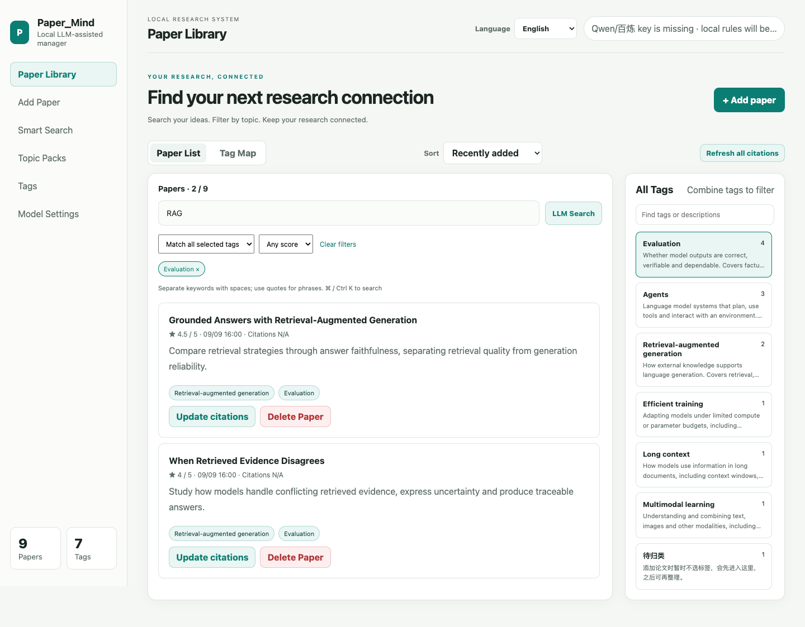

<p align="center"><sub>Actual interface, isolated sample library. Papers, notes and tag descriptions are demonstration content. No personal data or live model calls were used.</sub></p>

## One paper, from saving to finding

Follow the same sample paper, **Reading Papers with Evidence-Aware Agents**, through every step. Save it today; find it later using the **Agents** tag, even if you have forgotten the title.

**Open a paper → Check the details → Choose tags → Save → Open the library → Search tags → Filter papers → Read the details**

New here? [Load the extension](#get-started) first. Saving and tag filtering need no API key. Tag descriptions in these screenshots are prewritten demo text; configure an LLM to generate descriptions for your own collection.

### 01 · Open a paper and click Paper_Mind in the toolbar

The extension attempts to bring the page's **title, abstract, source link and selected text** into the capture popup. Check the extracted content and edit or complete any missing fields.

<p align="center">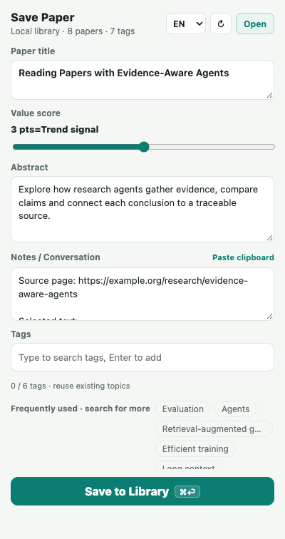</p>

### 02 · Search for an existing tag and read its description

Type **agent** in the tag input near the bottom. The existing **Agents** tag appears with a description. Read its scope, then click the suggestion to select it.

Search works across names, aliases and descriptions. **Reuse the existing tag** to keep related papers together instead of creating a new spelling for each one.

<p align="center">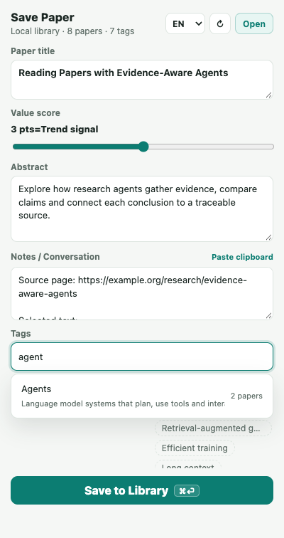</p>

### 03 · Add a reason to revisit it, then save

Search for **evaluation** and select **Evaluation** as the second tag. Set the score to **4.5** and add a reading note about verifying evidence after tool use. Click **Save to Library** when ready.

You can organize later: saving without tags places the paper in **Unsorted**.

<p align="center">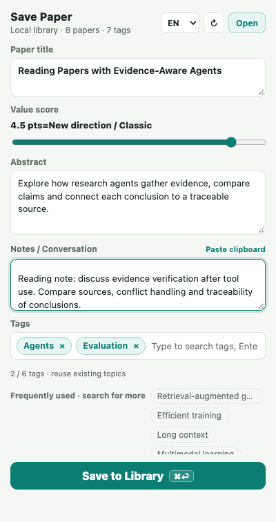</p>

### 04 · Confirm that the paper was saved

The popup shows **Already saved** with the stored tags, and the sample library grows from **8 to 9 papers**. A **Saved to the local library ✓** message confirms the submission.

**View in manager** opens this paper directly. For the walkthrough, click **Open** in the top-right corner instead, so we can find it from the complete library.

<p align="center">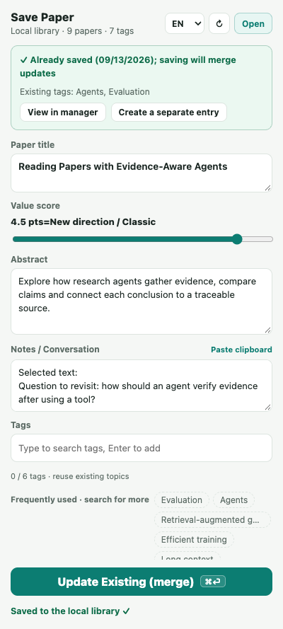</p>

### 05 · Open the library and see the new paper first

In **Paper Library**, sort by **Recently added**. The new paper appears first, with its title, abstract, score and both tags visible on the card.

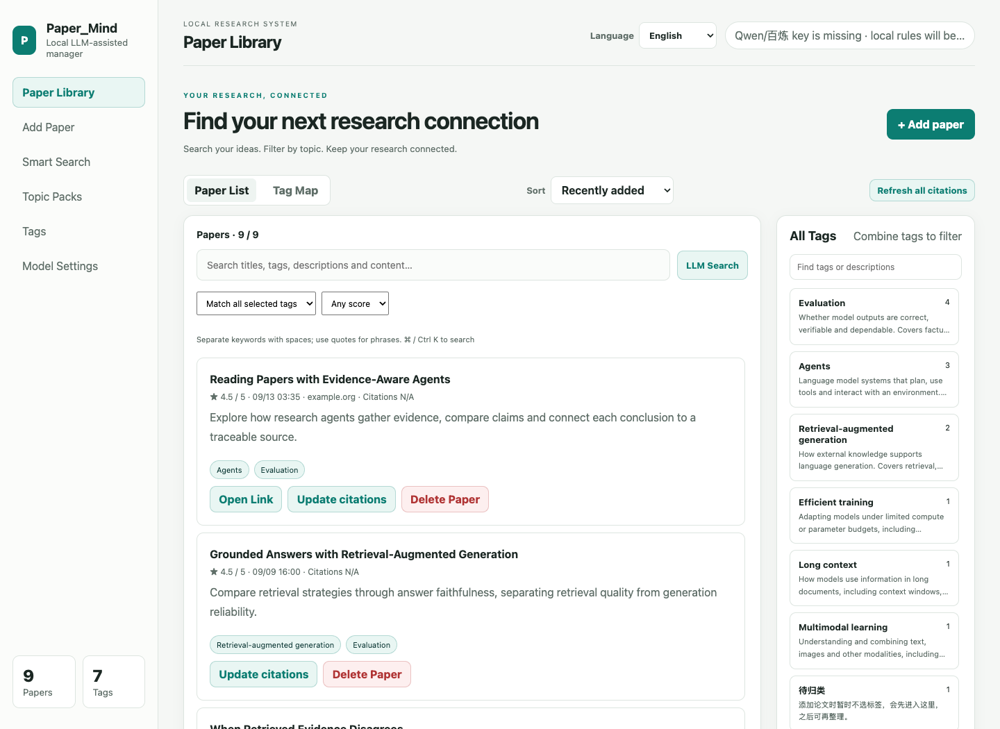

### 06 · Forgot the title? Search the tags on the right

Imagine coming back a few days later and only remembering that the paper involved agents. Type **agent** into **Find tags or descriptions** on the right. Check the **Agents** description and its linked-paper count.

Typing here narrows the **tag choices**. The paper list still contains all nine papers; clicking the tag in the next step applies the paper filter.

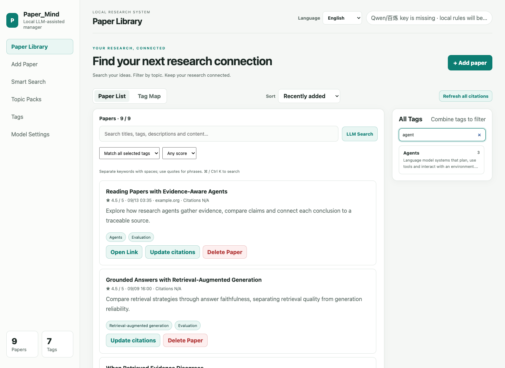

### 07 · Click Agents: nine papers become three

Click the **Agents** tag on the right. It appears among the active filters, and the library shows only the **three linked papers**, including the one you just saved.

Too many results in your own collection? Change the right-hand tag search to **evaluation**, then select **Evaluation** with all-tag matching. You can also type a keyword in the paper search field on the left. **Clear filters** returns to the full library.

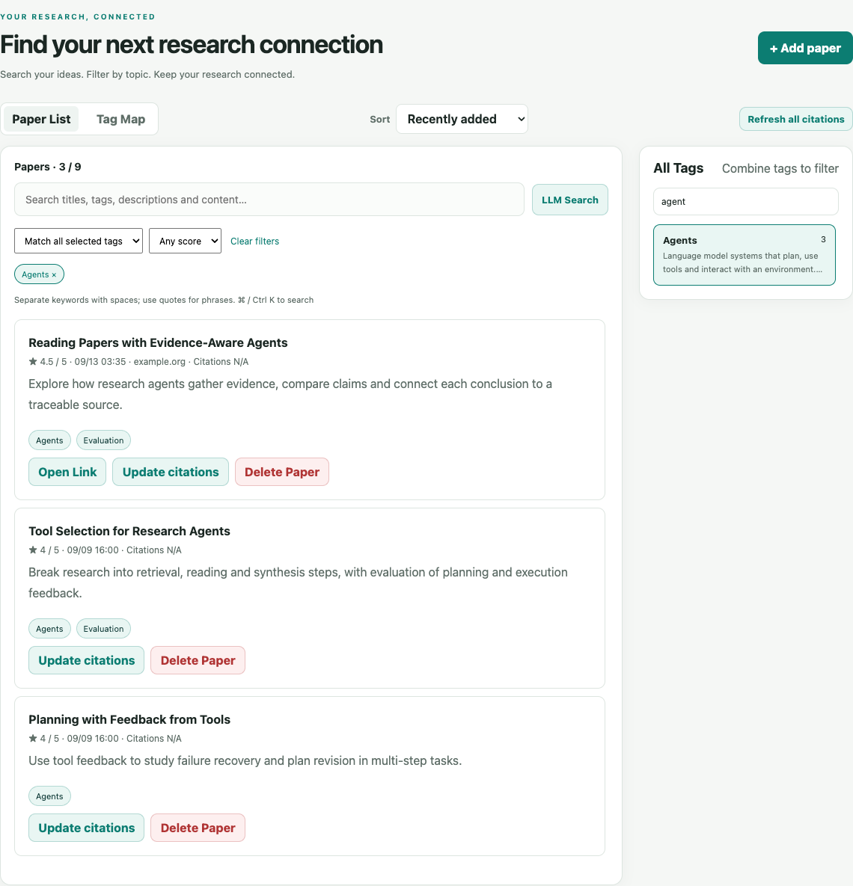

### 08 · Open the paper and recover your reading notes

Click **Reading Papers with Evidence-Aware Agents**. Its detail page shows the saved abstract, **Agents / Evaluation** tags and your note about evidence verification. The original page link is preserved with the notes too.

You have gone from a research topic back to the paper—and the reason you wanted to read it again.

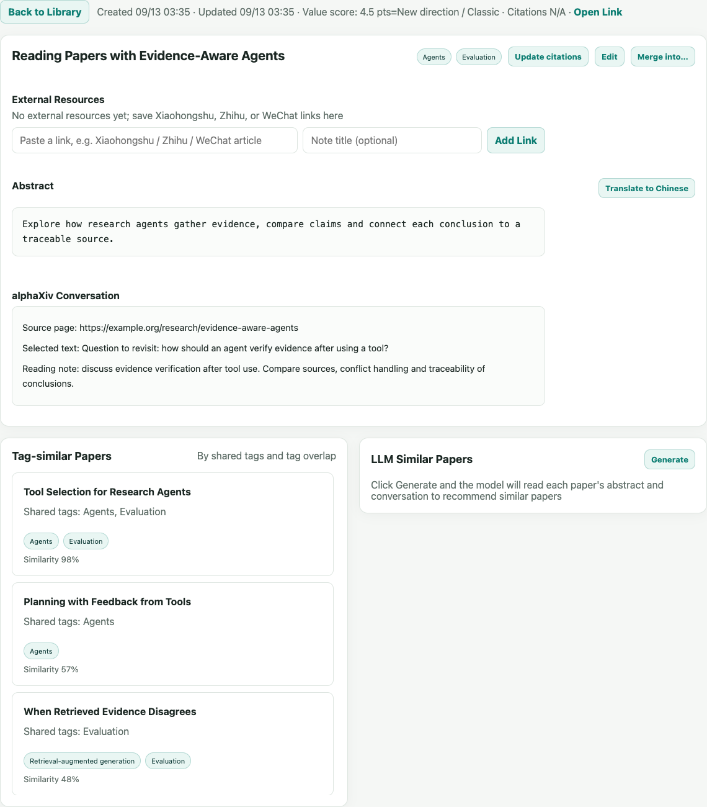

## Saving a paper is easy. Finding it later should be, too.

A few weeks after saving a paper, you remember that it had something to do with trustworthy RAG. Paper_Mind turns that clue into searchable content, useful tags and reusable reading lists.

| What you remember | How to find it |
| --- | --- |
| “I forgot the title, but it mentioned RAG and evaluation.” | Search across titles, abstracts, notes, tags and clipped article text with multiple keywords. |
| “Show me RAG evaluation methods, starting with papers I rated highly.” | Combine tags with all/any matching, then add a score filter. |
| “I saved a write-up explaining this method.” | Open the paper to browse its linked write-ups and materials in one record. |
| “Which papers have I already read that connect to this one?” | Browse shared-tag matches or use optional LLM recommendations from your collection. |

`Cmd / Ctrl K` to search · Space-separated keywords · Quoted phrases · 24 papers per page

## You choose the tags. AI helps explain their meaning.

A tag should tell you **what belongs in it, and what makes it different from the next tag**.

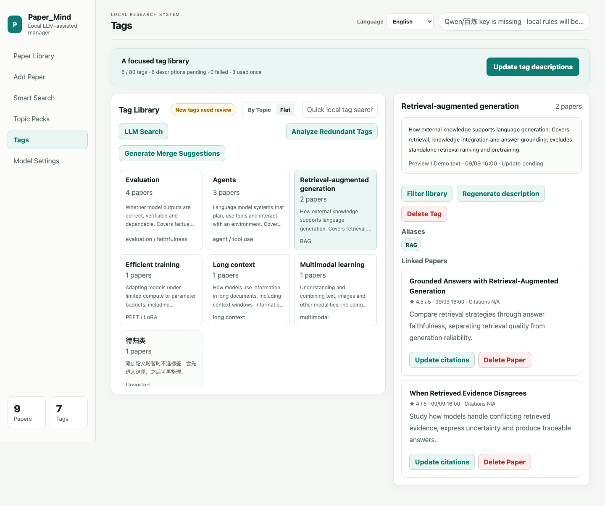

For example, a description can distinguish retrieval used to ground generated answers from standalone retrieval ranking. Read that distinction while choosing a tag, before adding another near-duplicate.

- **Grounded in your reading.** The model uses your tag names, aliases and excerpts from linked papers' abstracts, notes and clipped content.
- **A manageable vocabulary.** Defaults allow **6 tags per paper** and **80 across the library**, adjustable in Settings. Existing tags are retained.
- **Reuse before adding.** Search names, aliases and descriptions, with up to eight relevant suggestions. Normalized spelling variants reuse existing tags.
- **Review semantic merges.** The model proposes synonyms; you decide what to merge. An identical set of linked papers is a review clue, not proof that two tags mean the same thing.
- **Descriptions that can be maintained.** Background batches, caching and retries keep the process manageable. Changed source samples trigger updates; failed requests keep the previous description.

> Bringing an existing collection? Configure a model, then open **Tag Library → Update tag descriptions**. You can also regenerate an individual tag's description.

## Keep the useful details while you are reading

Alongside the paper-saving walkthrough above, you can keep write-ups and supporting materials together.

| While reading | In your library |
| --- | --- |
| Save a paper | Keep its title, abstract, source and notes together. Untagged entries go to **Unsorted**. |
| Clip a blog post or other write-up | Save the body as Markdown, preserving headings, lists, tables and code blocks. |
| Collect several explanations of one paper | Matching by arXiv ID, DOI or title suggests a connection. Confirm the merge to keep the materials under one paper. |
| Encounter an already saved paper | Update the existing record or choose to keep a separate entry. |

Clipped images are downloaded to local files when possible; successfully saved images can be viewed offline. Clipboard text is read only after clicking **Paste clipboard**.

## Turn a research question into an evolving reading list

“Trustworthy RAG” can be a rule: include both **Retrieval-augmented generation + Evaluation**, exclude **Agents**. Save it as a topic pack and newly collected papers that meet the criteria appear there too.

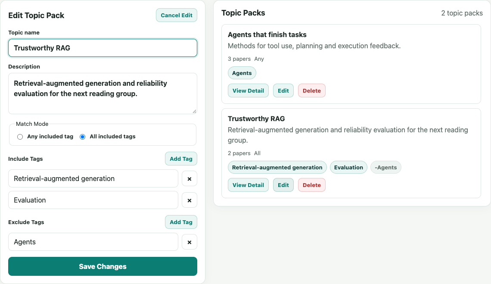

Use packs for a reading group, related-work section or ongoing research direction. Merging tags also migrates the pack's inclusion and exclusion references.

## Useful locally. AI when you want it.

| No model API key needed | Available with a configured model |
| --- | --- |
| Paper capture, web clipping and tag organization | Tag descriptions based on your paper content |
| Local full-text search, tag and score filters | Natural-language semantic search |
| Topic packs and shared-tag paper matches | Content-based recommendations from your library |
| JSON import/export and backup | Suggestions for merging synonymous tags |

Supports **Qwen / DashScope, Zhipu GLM, Kimi Code and DeepSeek**, with configurable models and base URLs.

Your library is stored on your machine, with no account required. **After configuring an API key, automatic tag descriptions, abstract translation and new-paper recommendations may send relevant text to your selected provider in the background.** You can disable automatic tag descriptions in Settings. Descriptions use excerpts from up to six linked papers; they do not imply the model has read an entire PDF. API keys are excluded from JSON exports and backups.

Also included: English and Simplified Chinese interfaces, system-aware dark mode, citation lookup and a daily JSON backup scheduled for 4 PM. Chrome must be running; larger libraries should also use manual export. See the [feature guide](docs/features.zh-CN.md) and [privacy policy](PRIVACY.md) for details.

## Get started

**No build step or local server is required to load the extension.**

1. Use **Code → Download ZIP** on the repository page and unzip it, or clone this repository.
2. Open `chrome://extensions` and enable **Developer mode**.
3. Click **Load unpacked** and select the project's **`extension/` folder**, not the repository root.
4. Pin Paper_Mind to the toolbar. Open a paper and click the icon to save it.

**Already installed?** Update your local files, click **↻ Reload** on the extension card and reopen the manager. No uninstall is needed.

**Want AI descriptions?** Add an API key in **Manager → Model settings**, then update descriptions in the Tag Library.

**Want to view saved images?** Enable **Allow access to file URLs** in the extension's details.

## Development and contributions

The extension uses native ES modules. Edit `extension/`, reload the extension and verify the change.

```bash
npm ci
npm test                         # Search, storage and background-task checks
npx playwright install chromium
npm run test:ui                  # Browser interaction regression checks
npm run package:extension        # Writes dist/Paper_Mind-extension.zip
```

With Chrome already installed, use `PW_CHANNEL=chrome npm run test:ui`. Tests use isolated data and mocked model replies.

- [Contributing](CONTRIBUTING.md) · [Changelog](CHANGELOG.md) · [Reproducing the screenshots](assets/screenshots/README.md)
- Planned directions: Chrome Web Store, BibTeX / Zotero export, other browsers and configurable clip destinations. These are not current features.
- [Apache License 2.0](LICENSE)
