<div align="center">


<h1>Paper_Mind</h1>

<h3>Forgot the title and the method? Start with a rough idea.</h3>

<p>A lightweight, tag-based paper manager that turns fragments of memory into clues for finding papers again.</p>

[](CHANGELOG.md)
[](extension/manifest.json)
[](LICENSE)

**English** · [中文](README_zh.md) · [Feature video](#watch-the-feature-tour) · [Screenshot walkthrough](#one-paper-from-saving-to-finding) · [Install](#get-started) · [Full feature guide](docs/features.zh-CN.md)

</div>

## Watch the feature tour

**See Paper_Mind in action in about 2½ minutes.** Save a paper with several tags, combine the clues you remember, and recognize it by your own memory sentence. Play either edition right here in the README.

**English narration · 2:34**

https://github.com/user-attachments/assets/046375e1-bd08-4663-93ac-0858b0aeb835

[Download MP4](assets/videos/paper-mind-intro-en.mp4) · [Bilingual SRT](assets/videos/paper-mind-intro-en.srt)

**中文配音 · 2:37**

https://github.com/user-attachments/assets/3b7d2957-d1b1-41b9-b210-005e53877e07

[下载 MP4](assets/videos/paper-mind-intro-zh.mp4) · [双语 SRT](assets/videos/paper-mind-intro-zh.srt)

**English 2:34 / Mandarin 2:37 · 1080p · Warm neural male narration · Chinese and English subtitles visible together in both editions.** [Transcripts and production notes](assets/videos/README.md)

The opening begins with memories of agent optimization, OPD, or a particular team. It explains how to find a paper again, then returns to saving it today and keeping those clues. The tour follows saving material, recording your understanding, finding it later, and continuing to read and organize research, including meaningful tags, topic packs, model/effort choices and backups. Feature demonstrations use the actual interface and an isolated sample library; AI examples are prewritten. Detailed steps follow below.

## Start with what you remember

You know you have read that paper. Yet, some time later, **its full title and how the method actually works are hard to recall**. What stays might be: “something about agent optimization,” “perhaps the OPD algorithm,” or “maybe a paper from team XXX.” Sometimes you remember a research direction, sometimes an algorithm acronym, and sometimes only the team behind it. These clues vary in detail, but they may still leave you unable to name the paper.

**What if a vague idea could lead you to an existing tag, and that tag back to a paper you saved?** That is why we built **Paper_Mind**, a lightweight browser extension for managing papers through tags, with optional LLM assistance. When saving a paper, keep your understanding in tags and a one-line memory. When returning to it, start with what you still recall: **rough idea → existing tags → saved papers**. Narrow the search without first reconstructing the title or the method's details.

**Several tags describe one paper.** Its research direction, algorithm and team can all be tags, preserving different aspects of what you understood. A tag can also link to many papers. Start with one tag to find a related group, then combine tags to narrow the results to papers that match all those clues.

An LLM can use your labels and linked paper content to explain each tag's meaning and scope. Search matches tag names, aliases and descriptions locally. For a vaguer description, optional AI can suggest relevant existing tags; you choose a tag and explore its papers. Reuse tags and merge synonymous concepts to keep the collection clear, with no cap on tag counts. Your library stays on your machine; basic capture and search work without a configured model.

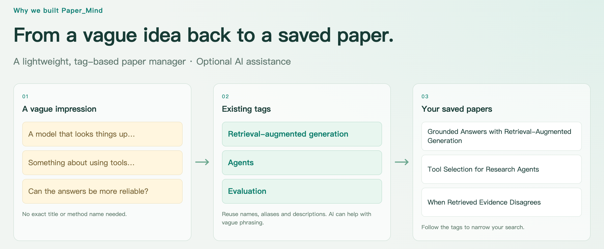

<p align="center"><sub>Illustrative example: several tags converge on one paper. XXX is a placeholder, not an attribution to an actual research team.</sub></p>

**To find a paper through those memories later, start by keeping the clues when you save it today.** Capture a paper or clip a useful write-up, choose relevant tags, and add one sentence about why it caught your attention. Keeping the material and your understanding together gives you a route back when only a direction, an algorithm or a team comes to mind. The screenshot walkthrough below follows that journey from saving a paper to finding it again.

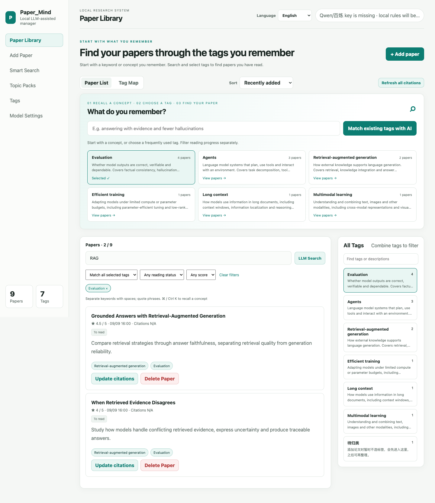

<p align="center"><sub>Actual interface, isolated sample library. Papers, notes and tag descriptions are demonstration content. No personal data or live model calls were used.</sub></p>

## One paper, from saving to finding

Follow the same sample paper, **Reading Papers with Evidence-Aware Agents**, through every step. Save it today; find it later using the **Agents** tag, even if you have forgotten the title.

**Open a paper → Check the details → Choose tags → Save → Open the library → Search tags → Filter papers → Read the details**

New here? [Load the extension](#get-started) first. Saving and tag filtering need no API key. Tag descriptions in these screenshots are prewritten demo text; configure an LLM to generate descriptions for your own collection.

### 01 · Open a paper and click Paper_Mind in the toolbar

The extension attempts to bring the page's **title, abstract, source link and selected text** into the capture popup. Check the extracted content and edit or complete any missing fields.

<p align="center">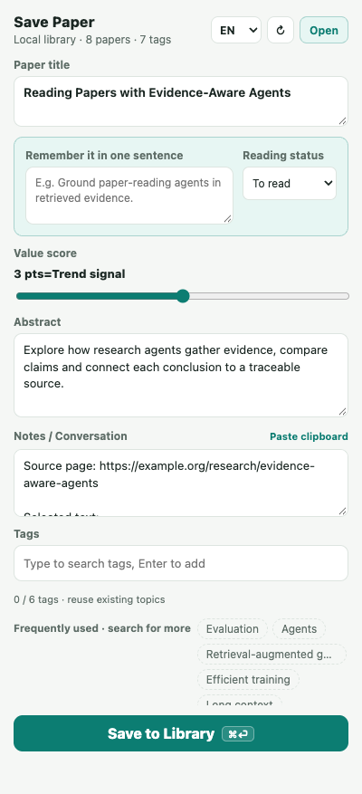</p>

### 02 · Search for an existing tag and read its description

Type **agent** in the tag input near the bottom. The existing **Agents** tag appears with a description. Read its scope, then click the suggestion to select it.

Search works across names, aliases and descriptions. **Reuse the existing tag** to keep related papers together instead of creating a new spelling for each one.

<p align="center">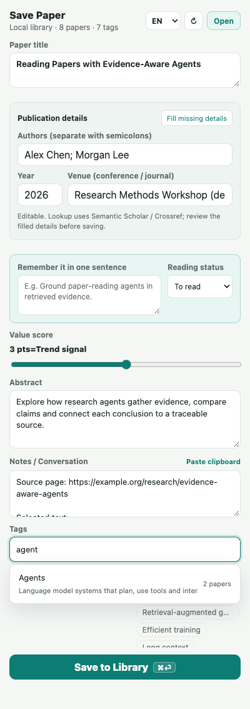</p>

### 03 · Remember it in one sentence and set its reading status

Also select **Evaluation**, set a **4.5** score, and write: “Check tool evidence before an agent answers questions about a paper.” Choose **Reading** as the status. Longer discussion points can stay in the notes. Then click **Save to library**.

The memory sentence captures your own impression in up to 280 characters. Reading status has its own field, so “Read” and “To read” need not become topic tags. Saving without topic tags is also possible: the paper goes to Unsorted.

<p align="center">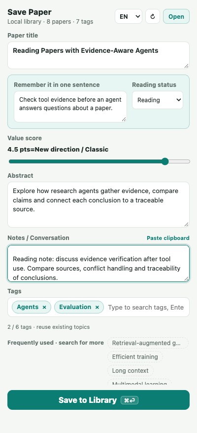</p>

### 04 · Confirm that the paper was saved

The popup shows **Already saved** with the stored tags, and the sample library grows from **8 to 9 papers**. A **Saved to the local library ✓** message confirms the submission.

**View in manager** opens this paper directly. For the walkthrough, click **Open** in the top-right corner instead, so we can find it from the complete library.

<p align="center">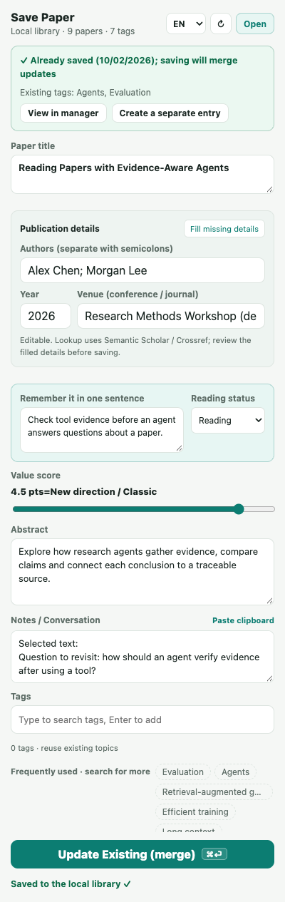</p>

### 05 · Open the library and see the new paper first

In **Paper Library**, sort by **Recently added**. The new paper appears first, with its title, abstract, score and both tags visible on the card.

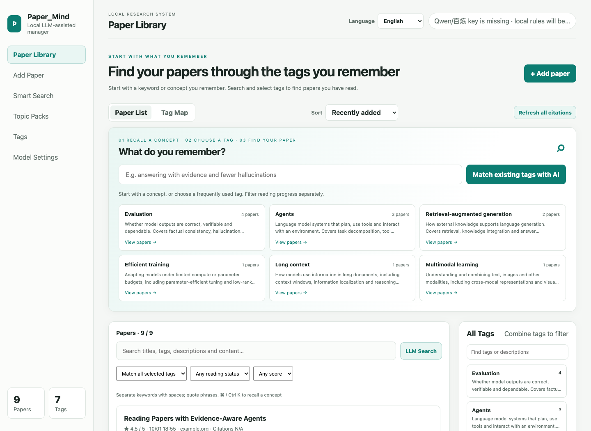

### 06 · Forgot the title? Start with a remembered concept

In **What do you remember?**, type “agents that read papers”. Local matching immediately searches existing tag names, aliases and descriptions. Each candidate shows its description and paper count.

For a looser memory, such as “answering with evidence and fewer hallucinations”, click **Match existing tags with AI**. The model also considers linked paper titles and memory sentences, returning up to six existing tags with reasons. **Searching never creates tags.** If the model is unavailable, local matches remain available.

This screenshot shows local matching before choosing a tag; all nine papers remain in the library.

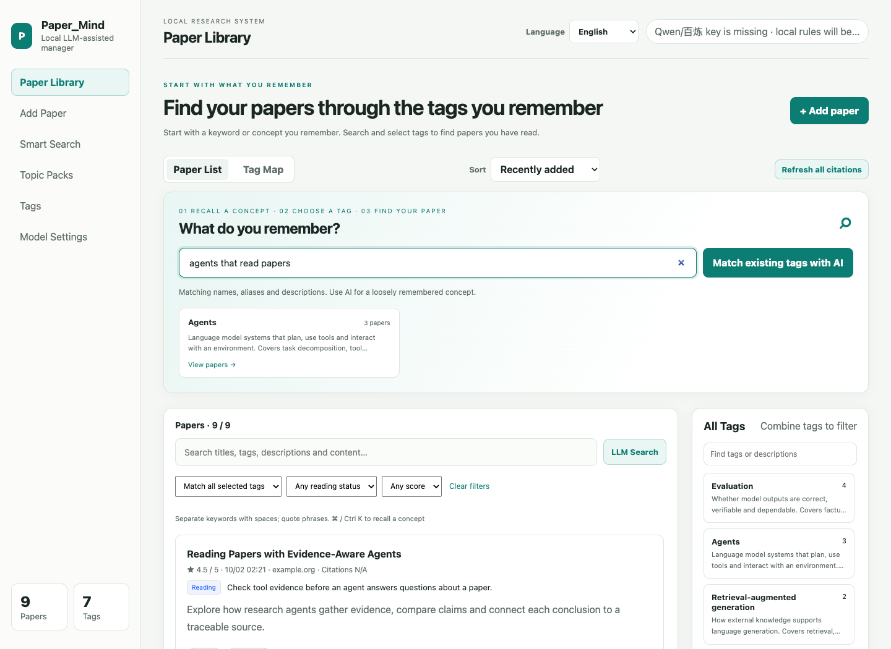

### 07 · Choose Agents: nine papers become three

Click **Agents → View papers** to see the **three** linked papers, including the one just saved. The selected tag appears in the filter row. The remembered sentence does not remain as a literal full-text constraint.

Choose additional tags and match all or any, then narrow by reading status or score. A separate full-text search remains available for remembered titles and exact keywords. **Clear filters** returns to the full library.

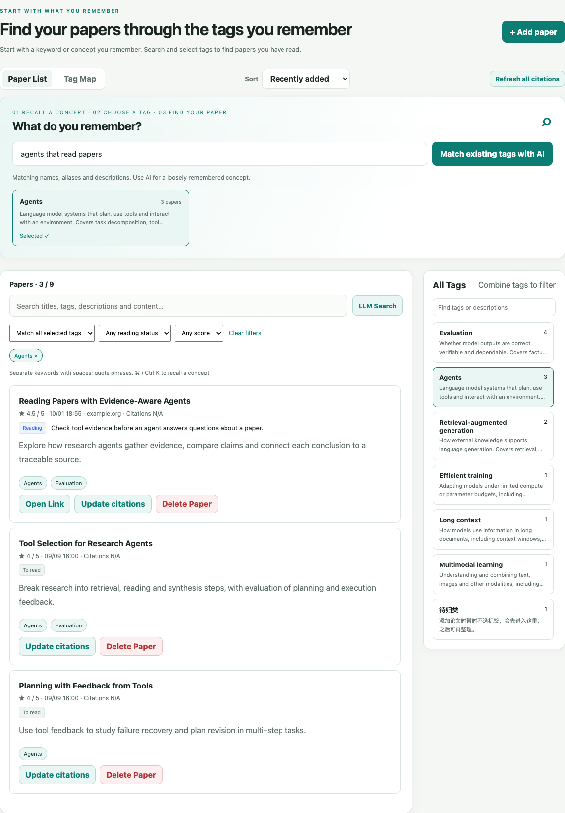

### 08 · Open the paper and recover your reading notes

Click **Reading Papers with Evidence-Aware Agents**. Its detail page shows the saved abstract, **Agents / Evaluation** tags and your note about evidence verification. The original page link is preserved with the notes too.

You have gone from a research topic back to the paper—and the reason you wanted to read it again.

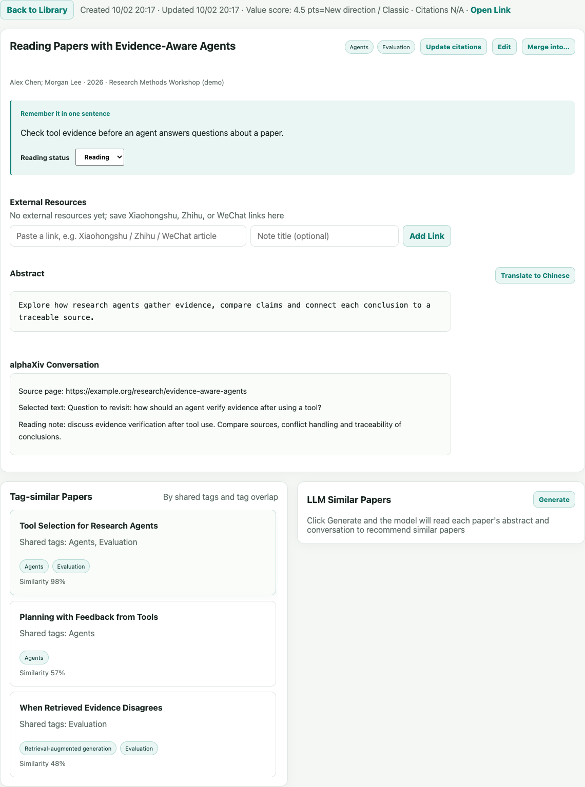

## Saving a paper is easy. Finding it later should be, too.

A few weeks after saving a paper, you remember that it had something to do with trustworthy RAG. Paper_Mind turns that clue into searchable content, useful tags and reusable reading lists.

| What you remember | How to find it |
| --- | --- |
| “I forgot the title, but it mentioned RAG and evaluation.” | Search across titles, abstracts, notes, tags and clipped article text with multiple keywords. |
| “Show me RAG evaluation methods, starting with papers I rated highly.” | Combine tags with all/any matching, then add a score filter. |
| “I saved a write-up explaining this method.” | Open the paper to browse its linked write-ups and materials in one record. |
| “Which papers have I already read that connect to this one?” | Browse shared-tag matches or use optional LLM recommendations from your collection. |

`Cmd / Ctrl K` to search · Space-separated keywords · Quoted phrases · 24 papers per page

## Keep narrowing from the clue you remember

After selecting a tag, **Narrow it down further** suggests tags that genuinely reduce the current results and shows the exact remaining count. Counts respect search, reading status and rating filters. Match-any mode offers a switch to match-all before narrowing. Tag counts remain unlimited.

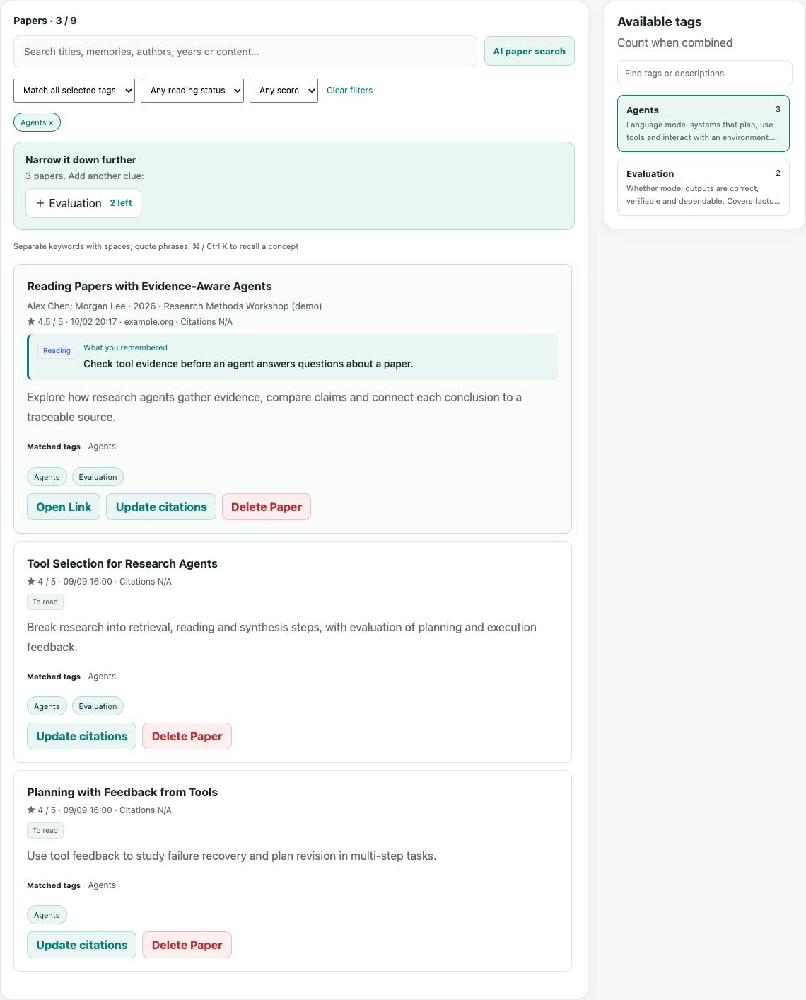

Results foreground **What you remembered** and highlight matching words. Evidence snippets identify actual matches in notes, abstracts, clipped text, tag descriptions or publication details, helping you recognize the right paper.

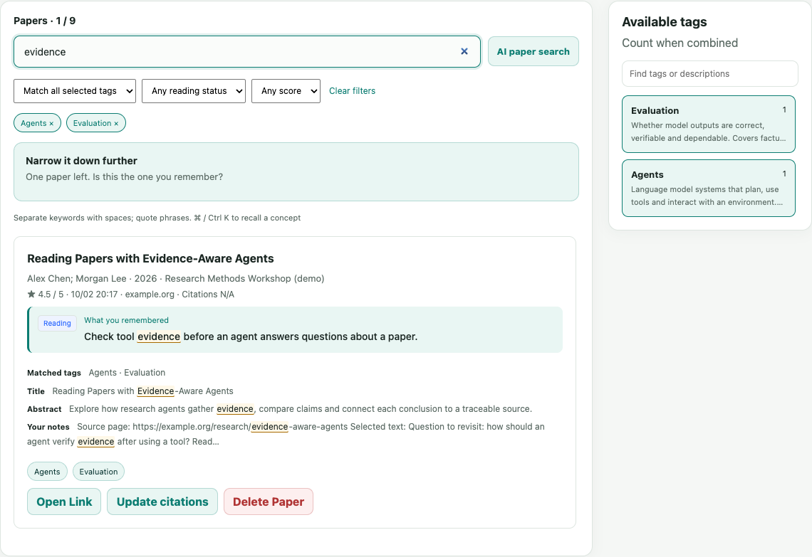

## Recall an author, year or publication venue

Capture reads academic page metadata when available. Authors, publication year and conference / journal are editable and searchable. For an existing paper, open **Details → Edit → Publication details → Fill missing details**. Separate author names with semicolons.

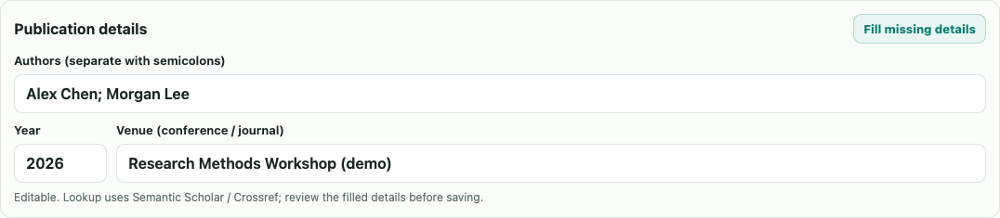

Lookup optionally uses Semantic Scholar / Crossref, preferring arXiv / DOI identifiers and accepting only unambiguous exact-title matches otherwise. It fills blanks, preserves manual edits, and waits for you to review and save. Unknown facts remain empty; they are not generated by a model. Authors and venues in these screenshots are synthetic examples. Publication fields are included in JSON backups and imports.

## You choose the tags. AI helps explain their meaning.

A tag should tell you **what belongs in it, and what makes it different from the next tag**.

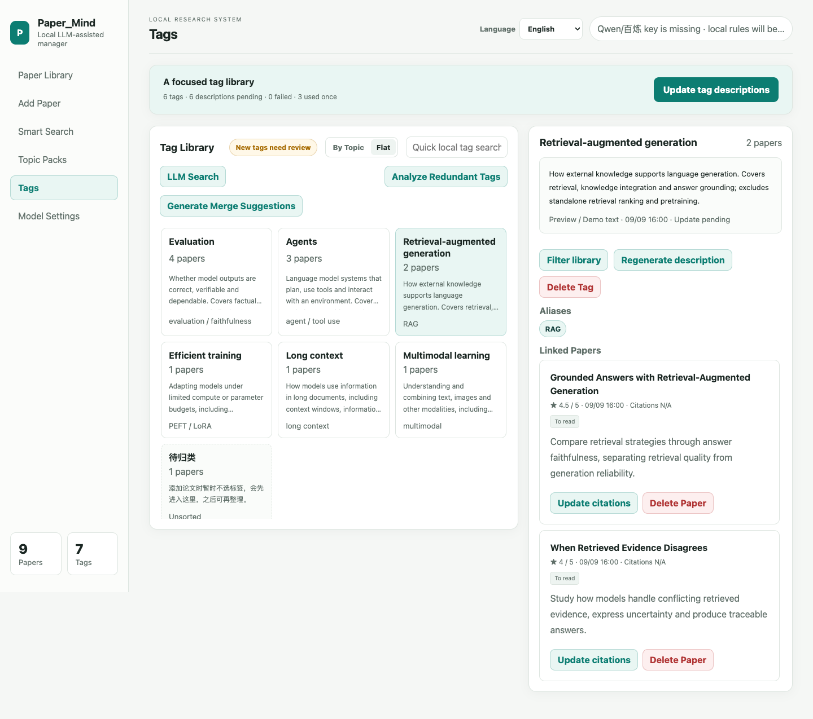

For example, a description can distinguish retrieval used to ground generated answers from standalone retrieval ranking. Read that distinction while choosing a tag, before adding another near-duplicate.

- **Grounded in your reading.** The model uses your tag names, aliases and excerpts from linked papers' abstracts, notes and clipped content.
- **Tags as needed.** Neither papers nor the library have a tag-count limit. Name reuse, aliases and merge suggestions keep the vocabulary clear.
- **Reuse before adding.** Search names, aliases and descriptions, with up to eight relevant suggestions. Normalized spelling variants reuse existing tags.
- **Review semantic merges.** The model proposes synonyms; you decide what to merge. An identical set of linked papers is a review clue, not proof that two tags mean the same thing.
- **Descriptions that can be maintained.** Background batches, caching and retries keep the process manageable. Changed source samples trigger updates; failed requests keep the previous description.

> Bringing an existing collection? Configure a model, then open **Tag Library → Update tag descriptions**. You can also regenerate an individual tag's description.

## Keep the useful details while you are reading

Alongside the paper-saving walkthrough above, you can keep write-ups and supporting materials together.

| While reading | In your library |
| --- | --- |
| Save a paper | Keep its title, abstract, source and notes together. Untagged entries go to **Unsorted**. |
| Clip a blog post or other write-up | Save the body as Markdown, preserving headings, lists, tables and code blocks. |
| Collect several explanations of one paper | Matching by arXiv ID, DOI or title suggests a connection. Confirm the merge to keep the materials under one paper. |
| Encounter an already saved paper | Update the existing record or choose to keep a separate entry. |

Clipped images are downloaded to local files when possible; successfully saved images can be viewed offline. Clipboard text is read only after clicking **Paste clipboard**.

## Turn a research question into an evolving reading list

“Trustworthy RAG” can be a rule: include both **Retrieval-augmented generation + Evaluation**, exclude **Agents**. Save it as a topic pack and newly collected papers that meet the criteria appear there too.

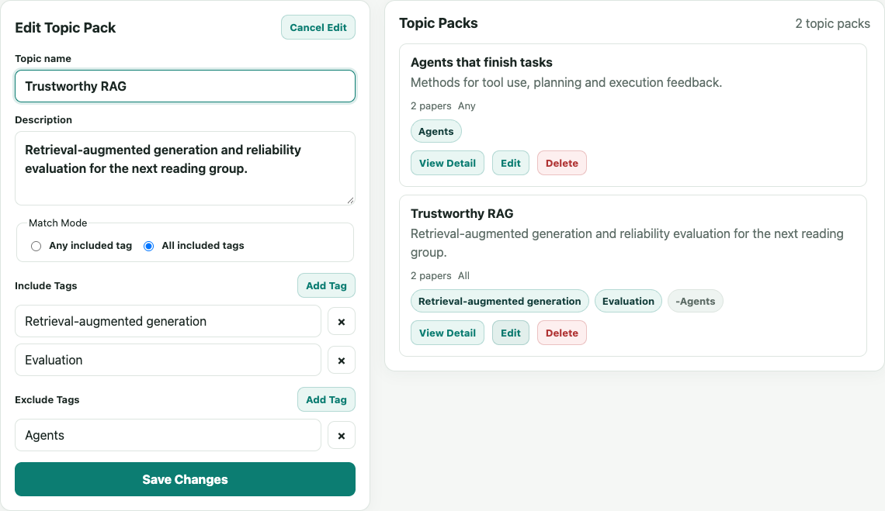

Use packs for a reading group, related-work section or ongoing research direction. Merging tags also migrates the pack's inclusion and exclusion references.

## Useful locally. AI when you want it.

| No model API key needed | Available with a configured model |
| --- | --- |
| Paper capture, web clipping and tag organization | Tag descriptions based on your paper content |
| Local full-text search, tag and score filters | Natural-language semantic search |
| Topic packs and shared-tag paper matches | Content-based recommendations from your library |
| JSON import/export and backup | Suggestions for merging synonymous tags |

Supports signed-in local **Claude Code and Codex**, **Qwen / DashScope, Zhipu GLM, Kimi Code and DeepSeek**, plus a **generic OpenAI-compatible API**. The selected backend powers concept matching, tag descriptions, translation and recommendations.

Your library is stored on your machine, with no account required. **After connecting a local CLI or an API, automatic tag descriptions, abstract translation and new-paper recommendations may send relevant text to your selected model service in the background. A local CLI does not imply offline inference.** You can disable automatic tag descriptions in Settings. Descriptions use excerpts from up to six linked papers; they do not imply the model has read an entire PDF. API keys and bridge tokens are excluded from JSON exports and backups.

Also included: English and Simplified Chinese interfaces, system-aware dark mode, citation lookup and a daily JSON backup scheduled for 4 PM. Chrome must be running; larger libraries should also use manual export. See the [feature guide](docs/features.zh-CN.md) and [privacy policy](PRIVACY.md) for details.

## Reading progress belongs in its own field

**To read → Reading → Read → Revisit** can be set during capture, updated directly in paper details, and filtered in the library. These states do not consume topic tags. Memory sentences are searchable and provide context for AI tag matching and descriptions.

Legacy records receive an empty memory and “To read”; existing tags remain intact and are not interpreted as progress. Merging sources preserves the target paper's progress and keeps additional memories in its notes. JSON backups preserve both new fields.

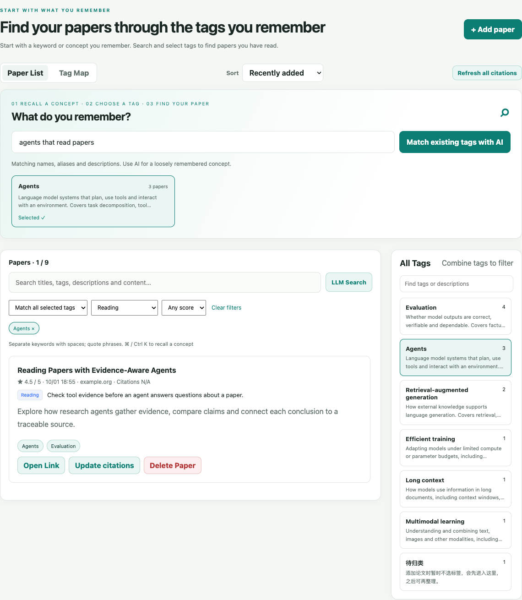

## Connect Claude Code, Codex, or another model API

Following the approach used by LLM_in_Word, the optional local path is **extension → loopback bridge → signed-in CLI**. Basic capture and local search remain independent of this service.

1. Install Node.js (22 or newer recommended) and your preferred CLI; sign in using `claude auth login` or `codex login`.
2. From the downloaded or cloned **Paper_Mind project root**, run:

   ```bash
   npm run bridge
   ```

   The bridge uses Node built-ins; project development dependencies are not required.
3. In **Manager → Model settings → Claude Code / Codex**, paste the URL and token printed in the terminal. Click **Check local connection**.
4. Checking the connection loads the model catalog; use **Refresh models** to reload it. Choose a **model** and **reasoning effort** separately for Claude and Codex, or enter a custom model ID. Default leaves the choice to the CLI. **Save settings**, then **Test model**. Keep the terminal open; press `Ctrl+C` to stop the service.

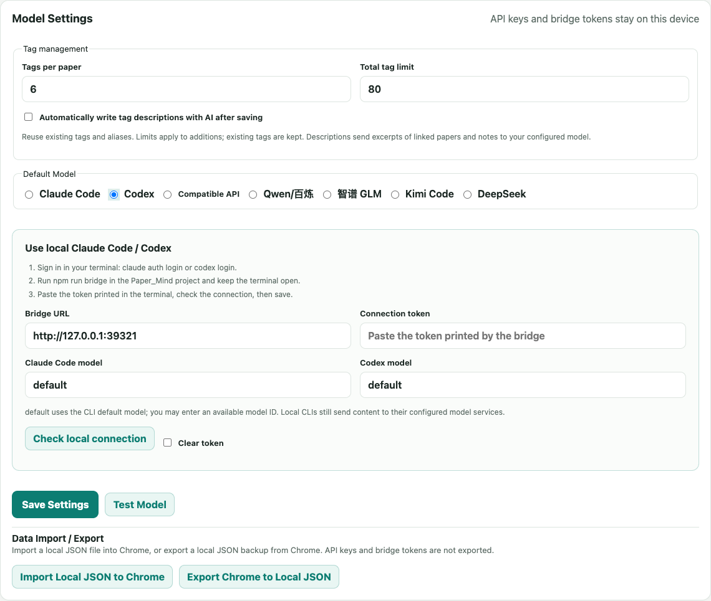

The bridge binds only to `127.0.0.1`, validates a token and bounds concurrent calls. Its token is stored in `~/.paper-mind/bridge-token` and survives restarts. For an API, choose **Compatible API**, enter a base URL, model ID and key; local compatible servers may omit the key. JSON mode is off by default and can be enabled for providers that support it.

Only Chat Completions-compatible APIs are supported; native Anthropic Messages / Responses APIs are not translated automatically. A successful CLI check confirms installation and login; actual calls still depend on model access, network and account limits. See [local model setup and troubleshooting](docs/local-models.md).

## Get started

**No build step or local server is required to load the extension.**

1. Use **Code → Download ZIP** on the repository page and unzip it, or clone this repository.
2. Open `chrome://extensions` and enable **Developer mode**.
3. Click **Load unpacked** and select the project's **`extension/` folder**, not the repository root.
4. Pin Paper_Mind to the toolbar. Open a paper and click the icon to save it.

**Already installed?** Update your local files, click **↻ Reload** on the extension card and reopen the manager. No uninstall is needed.

**Want AI descriptions?** Connect a local CLI or API in **Manager → Model settings**, save, then update descriptions in the Tag Library.

**Want to view saved images?** Enable **Allow access to file URLs** in the extension's details.

## Development and contributions

The extension uses native ES modules. Edit `extension/`, reload the extension and verify the change.

```bash
npm ci
npm test                         # Search, storage and background-task checks
npx playwright install chromium
npm run test:ui                  # Browser interaction regression checks
npm run package:extension        # Writes dist/Paper_Mind-extension.zip
```

With Chrome already installed, use `PW_CHANNEL=chrome npm run test:ui`. Tests use isolated data and mocked model replies.

- [Contributing](CONTRIBUTING.md) · [Changelog](CHANGELOG.md) · [Reproducing the screenshots](assets/screenshots/README.md)
- Planned directions: Chrome Web Store, BibTeX / Zotero export, other browsers and configurable clip destinations. These are not current features.
- [Apache License 2.0](LICENSE)
