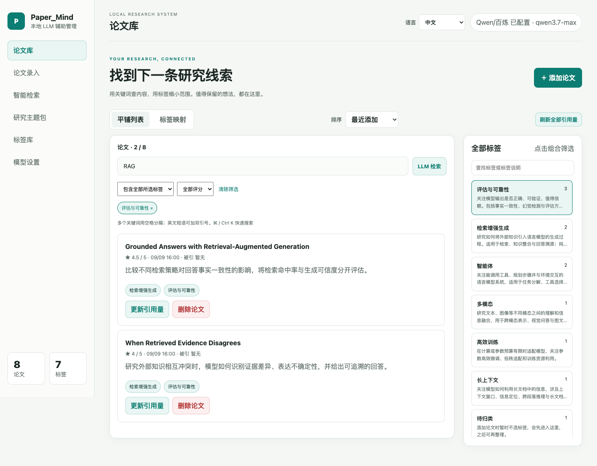
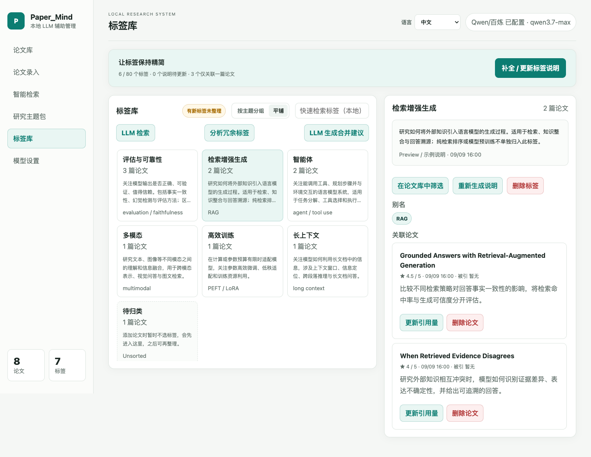
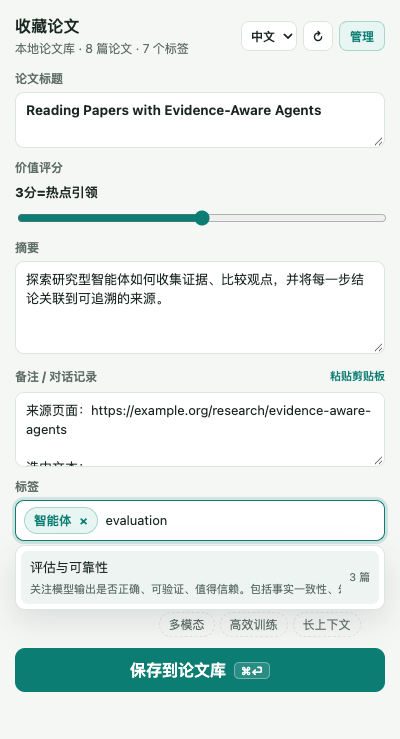
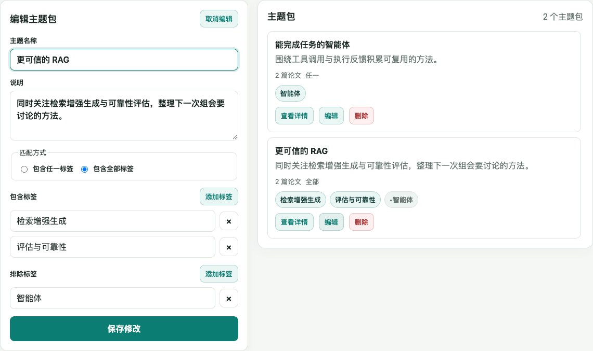

<div align="center">


<h1>Paper_Mind</h1>

<h3>把收藏的论文，变成下一次研究的起点。</h3>

<p>一键保存论文与解读，用有说明的标签整理，再用一个线索找到它。</p>

[](CHANGELOG.md)
[](extension/manifest.json)
[](LICENSE)

[English](README.md) · **中文** · [开始使用](#几步开始使用) · [完整功能](docs/features.zh-CN.md)

</div>



<p align="center"><sub>实际界面截图，使用独立的示例论文库。论文、笔记和标签说明均为演示内容；不含个人数据，未调用真实模型。</sub></p>

## 收藏时很容易，回头找也应该很容易

读到一篇好论文，顺手存下；几周后，只记得“和 RAG 的可信度有关”。Paper_Mind 帮你把这个模糊线索变成可查找的内容、标签和研究专题。

| 你手里的线索 | 在 Paper_Mind 里怎么找 |
| --- | --- |
| “标题忘了，只记得提到了 RAG 和 evaluation。” | 输入多个关键词，搜索标题、摘要、笔记、标签及剪藏正文。 |
| “我要看 RAG 的评估方法，优先看之前打过高分的。” | 组合标签，选择“全部 / 任一”，再加评分筛选。 |
| “我记得存过一篇讲这个方法的解读。” | 打开论文详情，在同一条记录里查看关联的解读与材料。 |
| “这篇和我之前读过的哪几篇有关？” | 查看共享标签的相似论文，或使用可选的 LLM 推荐。 |

`⌘ / Ctrl K` 聚焦搜索 · 空格组合关键词 · 双引号查短语 · 每页 24 篇

## 你选标签，AI 补上含义与边界

一个标签不只是名字，还应该回答：**它适合收什么论文，和旁边的标签有什么区别？**



以“检索增强生成”为例，说明可以区分“用外部知识支撑生成”与“单纯的检索排序”。输入标签时就能读到这些说明，选标签更有依据。

- **从你的论文出发。** LLM 根据人工选择的标签、别名，以及关联论文的摘要、笔记和正文片段编写说明。
- **让数量保持可控。** 默认每篇最多 **6 个**、全库最多 **80 个**标签，可在设置中调整；历史标签保留。
- **优先复用。** 名称、别名和说明都能搜，每次最多显示 8 个相关候选。大小写与全角拼写等确定性变体会复用已有标签。
- **合并由你判断。** LLM 提出同义标签的合并建议，你逐项审核。标签关联了相同论文，只是整理线索，不代表概念相同。
- **说明可以持续维护。** 支持后台分批生成、缓存和重试；采样内容改变后会更新，失败时保留已有说明。

> 已有论文库？配置模型后，进入 **标签库 → 补全 / 更新标签说明**。单个标签也可以重新生成。

## 看到值得读的，先把线索留下来

<p align="center">
  
</p>

打开论文页或解读文章，点击工具栏图标。扩展会尝试提取标题、摘要与来源，你补上价值评分、笔记和几个核心标签，再保存。

| 阅读时的动作 | 保存后的结果 |
| --- | --- |
| 收藏论文 | 标题、摘要、来源与阅读笔记汇入论文库；未选标签的进入“待归类”。 |
| 收藏博客、公众号文章等解读 | 正文保存为 Markdown，保留标题层级、列表、表格和代码块。 |
| 保存同一篇论文的多份解读 | 根据 arXiv 编号、DOI 或标题提示配对；确认并入后，材料归在同一条论文记录下。 |
| 再次遇到已收藏的论文 | 提示已有记录，可更新或按需单独保存。 |

剪藏图片会尝试下载为本地文件；下载成功的图片可以离线查看。剪贴板内容只在你点击 **“粘贴剪贴板”** 后读取。

## 为一个研究问题，留一份持续更新的阅读清单

“更可信的 RAG”可以是一组规则：同时包含 **检索增强生成 + 评估与可靠性**，排除 **智能体**。把它保存成研究主题包，以后符合条件的新论文也会出现在清单里。



适合准备组会、整理相关工作，或者持续跟进一个小方向。标签合并后，主题包里的包含 / 排除条件也会迁移。

## 本地就能用，AI 按需开启

| 无需模型 API Key | 配置模型后可用 |
| --- | --- |
| 论文收藏、网页剪藏、标签整理 | 根据论文内容生成标签说明 |
| 本地全文搜索、标签和评分筛选 | 用自然语言做语义检索 |
| 研究主题包、共享标签相似推荐 | 结合论文内容推荐库内相关论文 |
| JSON 导入 / 导出、备份 | 提出同义标签合并建议 |

支持 **Qwen / DashScope、智谱 GLM、Kimi Code、DeepSeek**；模型和 Base URL 可在设置中配置。

论文库保存在本机，不需要注册账号。**配置 API Key 后，自动说明、摘要翻译和新论文相似推荐可能在后台向所选服务商发送必要文本。** 自动标签说明可在设置中关闭；生成说明会使用最多 6 篇关联论文的内容片段，并不表示模型读过完整 PDF。API Key 不进入 JSON 导出和备份。

还支持中英文界面、跟随系统的深色模式、引用量查询，以及每天下午 4 点触发的自动 JSON 备份。浏览器需运行；大库请同时使用手动导出。详见 [功能说明](docs/features.zh-CN.md) 与 [隐私政策](PRIVACY.md)。

## 几步开始使用

**加载扩展不需要编译，也不需要启动服务。**

1. 在仓库页面点击 **Code → Download ZIP** 并解压，或克隆这个仓库。
2. 打开 `chrome://extensions`，开启右上角 **开发者模式**。
3. 点击 **加载已解压的扩展程序**，选择项目中的 **`extension/` 文件夹**，不是整个项目文件夹。
4. 把 Paper_Mind 固定到工具栏。打开一篇论文，点击图标即可收藏。

**已安装旧版？** 更新本地文件后，点击扩展卡片上的 **↻ 刷新**，重新打开管理页即可，无需卸载。

**需要 AI 标签说明？** 在 **管理页 → 模型设置** 填写 API Key，再到标签库补全说明。

**需要查看本地剪藏图片？** 在扩展详情中开启 **允许访问文件网址**。

## 开发与贡献

扩展使用原生 ES 模块。日常修改流程：编辑 `extension/` → 刷新扩展 → 验证功能。

```bash
npm ci
npm test                         # 搜索、存储、后台任务等逻辑测试
npx playwright install chromium
npm run test:ui                  # 浏览器交互回归
npm run package:extension        # 产出 dist/Paper_Mind-extension.zip
```

已有 Chrome 时可使用 `PW_CHANNEL=chrome npm run test:ui`。测试使用隔离数据与模拟模型回复。

- [参与贡献](CONTRIBUTING.md) · [版本记录](CHANGELOG.md) · [截图生成说明](assets/screenshots/README.md)
- 计划探索：Chrome 应用商店、BibTeX / Zotero 导出、其他浏览器与自定义剪藏目录。以上尚未作为现有功能提供。
- [Apache License 2.0](LICENSE)
