<div align="center">


<h1>Paper_Mind</h1>

<h3>用你记住的概念，找回读过的论文。</h3>

<p>以标签组织论文，以大模型辅助理解。轻量收藏，简洁管理。</p>

[](CHANGELOG.md)
[](extension/manifest.json)
[](LICENSE)

[English](README.md) · **中文** · [功能视频](#看一段功能介绍) · [跟着截图用一遍](#从保存到找回跟着一篇论文走一遍) · [安装扩展](#几步开始使用) · [完整功能](docs/features.zh-CN.md)

</div>

读完一篇论文，过一段时间，我们可能已经记不清它的完整标题，留在脑海中的却往往是几个关键词、一些概念，或者一个印象深刻的方法。比如“检索增强生成”“智能体”“证据验证”——这些零散的线索，共同构成了我们对这篇论文的整体印象，也常常是下一次想起它的起点。

**如果论文库也能按照这些概念来组织，找回一篇论文，就可以从你还记得的那个词开始。** 这正是 Paper_Mind 的设计出发点：一个基于标签系统、支持大模型辅助的轻量化论文管理平台，以 Chrome 扩展的形式融入阅读过程。保存论文、留下笔记、选几个核心标签，让脑海中的印象变成可以搜索、关联和回看的阅读积累。

你决定用哪些标签描述论文，大模型则根据你给出的标签和关联论文的内容，补充标签的含义与适用范围，辅助检索和发现相关论文。通过复用已有标签、合并同义概念，让分类保持清晰；标签数量不设上限。**轻量、简洁，让整理顺手发生，让查找从一个概念开始。** 论文库保存在本机，基础收藏与查找无需配置模型。

## 看一段功能介绍

[](assets/videos/paper-mind-intro-zh.mp4)

**[▶ 观看 / 下载视频](assets/videos/paper-mind-intro-zh.mp4)** · 2 分 9 秒 · 1080p · 中文配音与字幕 · [制作说明与字幕文件](assets/videos/README.md)

跟随同一篇论文，看完“收藏 → 一句话记住它 → 概念匹配标签 → 找回论文”，以及阅读状态、标签说明、模型与 effort 设置。使用实际界面和隔离演示数据，未发起在线模型调用。

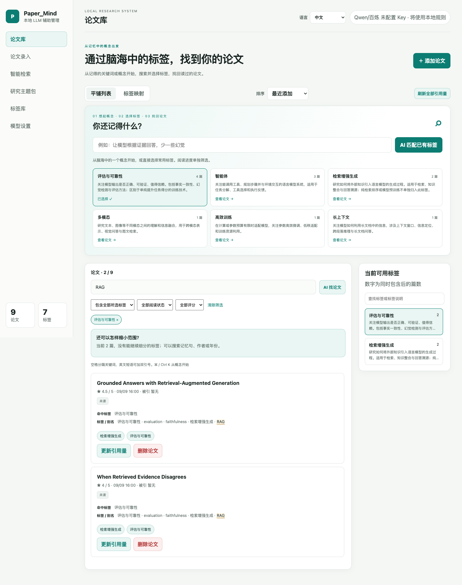

<p align="center"><sub>实际界面截图，使用独立的示例论文库。论文、笔记和标签说明均为演示内容；不含个人数据，未调用真实模型。</sub></p>

## 从保存到找回，跟着一篇论文走一遍

下面始终使用同一篇示例论文 **Reading Papers with Evidence-Aware Agents**：第一次读到时保存，过几天忘了标题，只凭“智能体”这个标签把它找回来。

**打开论文 → 检查信息 → 选择标签 → 保存 → 打开论文库 → 搜索标签 → 点击筛选 → 阅读详情**

还没安装？先完成 [加载扩展](#几步开始使用)，再跟着下面操作。收藏与标签查找无需 API Key；示例中的标签说明为预置演示文本，真实使用时可配置 LLM 生成。

### 01 · 打开论文，点击工具栏中的 Paper_Mind

扩展会尝试把当前页面的**标题、摘要、来源链接和选中文本**带进收藏弹窗。先检查内容；页面未提供摘要或识别不完整时，可以直接补充、修改。

<p align="center">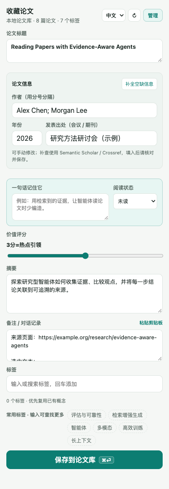</p>

### 02 · 输入标签，先看看已有分类

在底部标签输入框输入 **agent**，会找到已有的 **智能体** 标签。候选项带有说明，读完确认它适合这篇论文，再点击候选项。

名称、别名和说明都能搜索。**选择已有标签，就能沿用同一分类**，不用为 agent、Agents、智能体分别建三个标签。

<p align="center">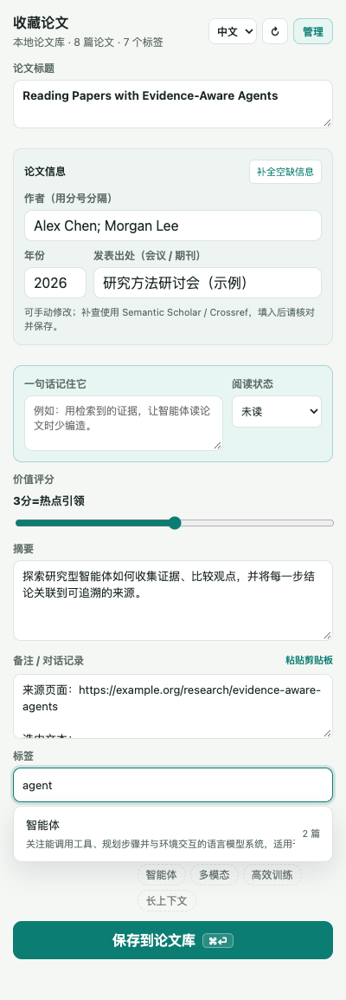</p>

### 03 · 用一句话记住它，再单独记录阅读进度

再选择 **评估与可靠性**，把评分设为 **4.5**。在 **一句话记住它** 写下：“先验证工具返回的证据，再让智能体回答论文问题。”把 **阅读状态** 设为 **在读**，备注里还可以记录组会要讨论的问题。确认后点击 **保存到论文库**。

记忆句保留你对论文的个人印象，最多 280 字；阅读状态独立于标签，不需要再建“未读 / 已读”标签。暂时不选概念标签也能保存，论文会进入“待归类”。

<p align="center">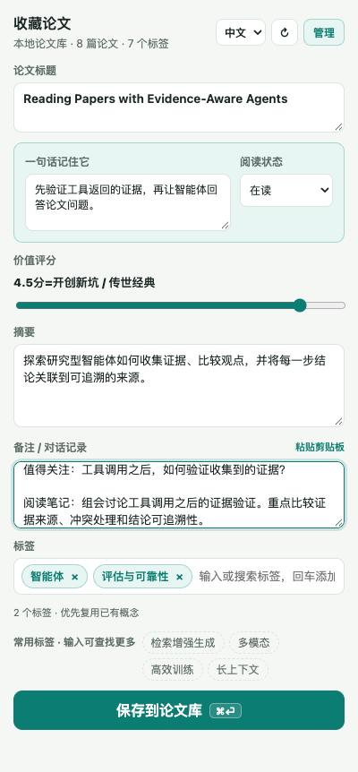</p>

### 04 · 看到“已收藏”，确认保存成功

保存后，弹窗出现 **已收藏** 提示及已存标签，示例论文总数由 **8 变为 9**。下方同时显示“已收藏到本地论文库 ✓”。

**在管理页查看**可以直接打开这篇论文。为了演示以后怎么找回它，下面点击右上角 **管理**，从完整论文库开始。

<p align="center">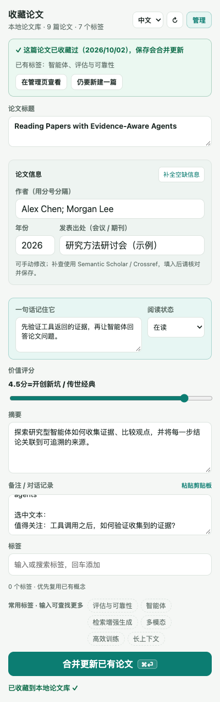</p>

### 05 · 打开论文库，刚收藏的论文在最前面

在 **论文库** 中按 **最近添加** 排序，就能看到刚才保存的论文卡片。标题、记忆句、阅读状态、摘要、评分和两个标签都在，便于快速确认。

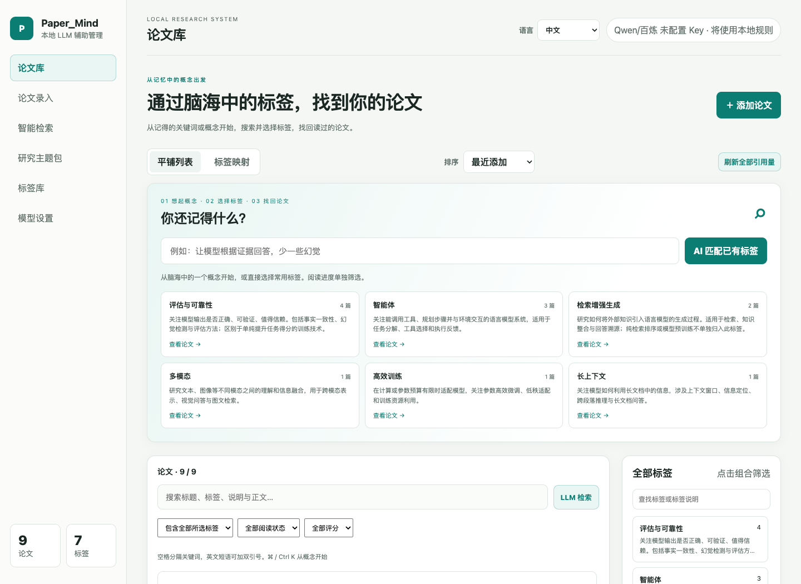

### 06 · 忘了标题？从脑海中的概念开始

在论文库顶部 **你还记得什么？** 输入：“我记得与智能体有关”。系统先从**已有标签的名称、别名和说明**里即时找候选，展示每个标签的说明和关联论文数量。

如果只记得模糊描述，例如“让回答有证据、少一些幻觉”，点击 **AI 匹配已有标签**。模型还会结合关联论文的标题和记忆句，最多返回 6 个已有标签及匹配理由。**搜索不会创建新标签**；模型不可用时保留本地匹配结果。

截图演示的是本地匹配，尚未选择标签，论文列表仍有 9 篇。

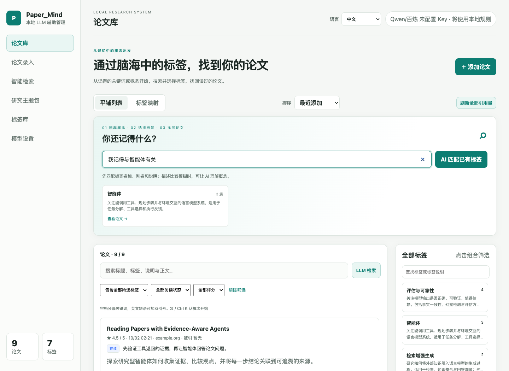

### 07 · 选择“智能体”，9 篇缩小到 3 篇

点击候选卡片 **智能体 → 查看论文**，结果只保留关联的 **3 篇论文**，刚才收藏的那篇就在其中。选中的概念标签会明确显示在筛选条件里；模糊描述不会继续作为全文硬匹配条件。

还可继续选择 **评估与可靠性**，用“包含全部 / 任一所选标签”组合筛选，叠加阅读状态或评分。下方另有全文搜索，适合已经记得题名或原文关键词时使用。点击 **清除筛选**返回全部论文。

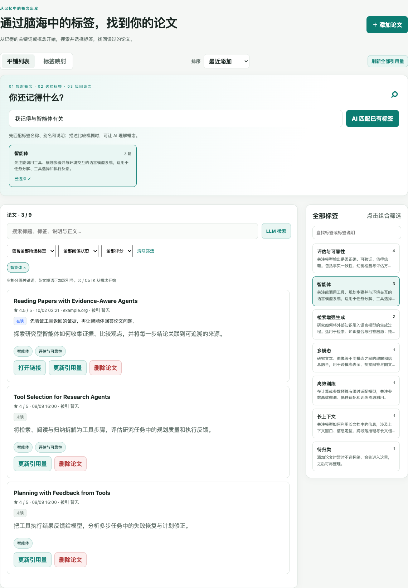

### 08 · 点击论文卡片，找回当时的思路

点击 **Reading Papers with Evidence-Aware Agents**。详情页最上方是你的**记忆句与阅读状态**，往下是摘要、**智能体 / 评估与可靠性** 标签和笔记。可以直接修改阅读状态，也可点“编辑”调整记忆句。原始页面链接也随笔记保留下来。

从“这个研究方向”回到“这篇论文为什么值得读”，收藏到找回的流程就完成了。

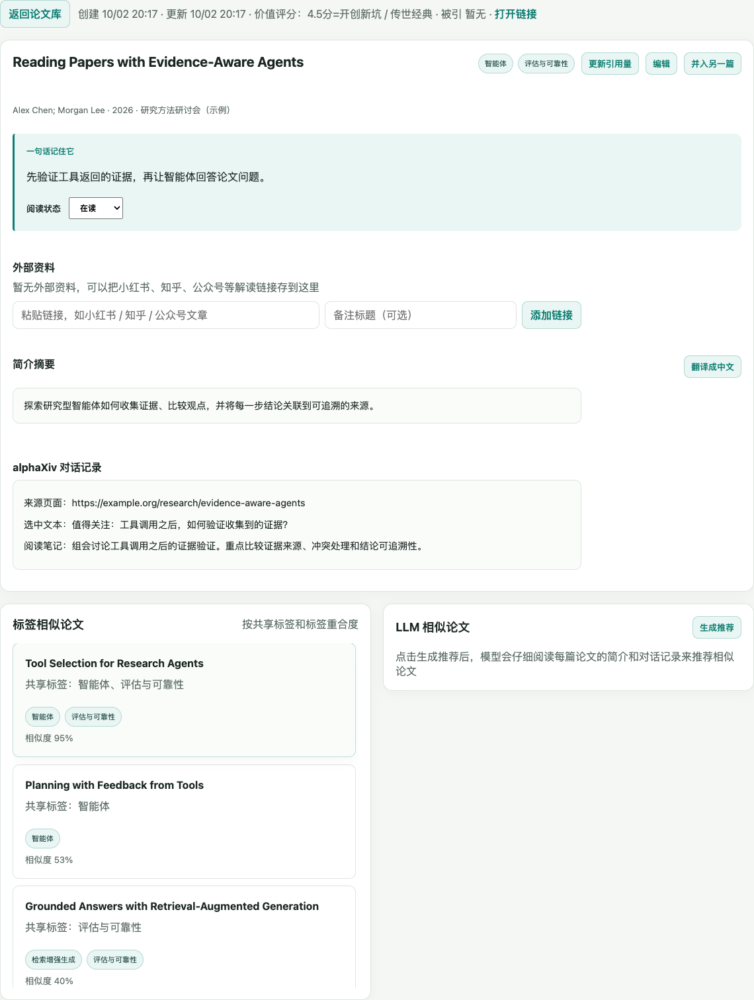

## 收藏时很容易，回头找也应该很容易

读到一篇好论文，顺手存下；几周后，只记得“和 RAG 的可信度有关”。Paper_Mind 帮你把这个模糊线索变成可查找的内容、标签和研究专题。

| 你手里的线索 | 在 Paper_Mind 里怎么找 |
| --- | --- |
| “标题忘了，只记得提到了 RAG 和 evaluation。” | 输入多个关键词，搜索标题、摘要、笔记、标签及剪藏正文。 |
| “我要看 RAG 的评估方法，优先看之前打过高分的。” | 组合标签，选择“全部 / 任一”，再加评分筛选。 |
| “我记得存过一篇讲这个方法的解读。” | 打开论文详情，在同一条记录里查看关联的解读与材料。 |
| “这篇和我之前读过的哪几篇有关？” | 查看共享标签的相似论文，或使用可选的 LLM 推荐。 |

`⌘ / Ctrl K` 聚焦搜索 · 空格组合关键词 · 双引号查短语 · 每页 24 篇

## 你选标签，AI 补上含义与边界

一个标签不只是名字，还应该回答：**它适合收什么论文，和旁边的标签有什么区别？**

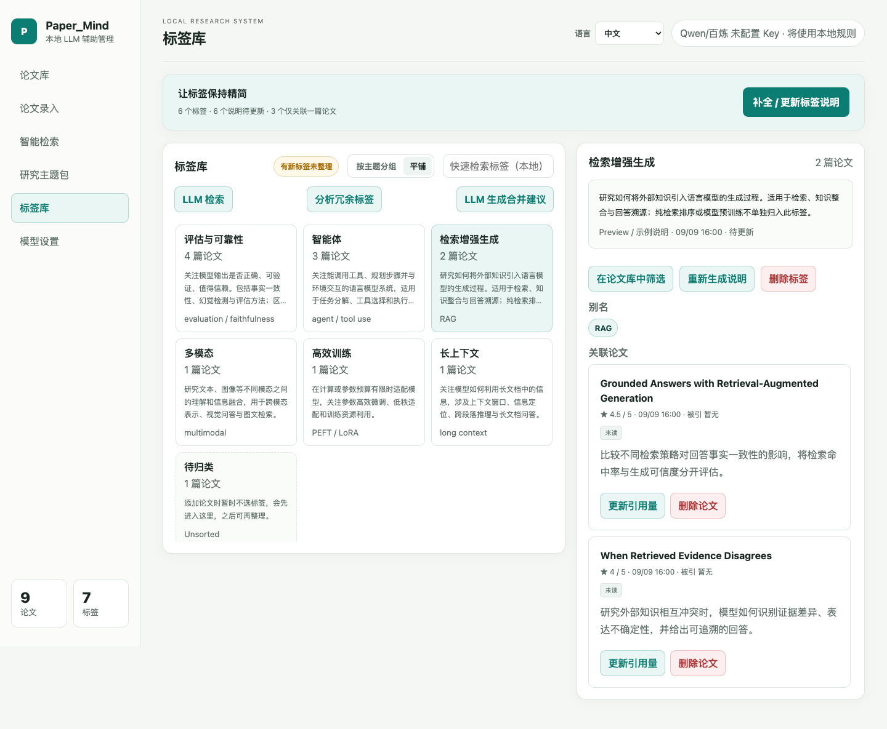

以“检索增强生成”为例，说明可以区分“用外部知识支撑生成”与“单纯的检索排序”。输入标签时就能读到这些说明，选标签更有依据。

- **从你的论文出发。** LLM 根据人工选择的标签、别名，以及关联论文的摘要、笔记和正文片段编写说明。
- **按需要添加标签。** 每篇论文和整个论文库都不限制标签数量；名称复用、别名和合并建议帮助保持清晰。
- **优先复用。** 名称、别名和说明都能搜，每次最多显示 8 个相关候选。大小写与全角拼写等确定性变体会复用已有标签。
- **合并由你判断。** LLM 提出同义标签的合并建议，你逐项审核。标签关联了相同论文，只是整理线索，不代表概念相同。
- **说明可以持续维护。** 支持后台分批生成、缓存和重试；采样内容改变后会更新，失败时保留已有说明。

> 已有论文库？配置模型后，进入 **标签库 → 补全 / 更新标签说明**。单个标签也可以重新生成。

## 看到值得读的，先把线索留下来

除了上面的论文收藏流程，还能把解读文章和补充材料一起留下来。

| 阅读时的动作 | 保存后的结果 |
| --- | --- |
| 收藏论文 | 标题、摘要、来源与阅读笔记汇入论文库；未选标签的进入“待归类”。 |
| 收藏博客、公众号文章等解读 | 正文保存为 Markdown，保留标题层级、列表、表格和代码块。 |
| 保存同一篇论文的多份解读 | 根据 arXiv 编号、DOI 或标题提示配对；确认并入后，材料归在同一条论文记录下。 |
| 再次遇到已收藏的论文 | 提示已有记录，可更新或按需单独保存。 |

剪藏图片会尝试下载为本地文件；下载成功的图片可以离线查看。剪贴板内容只在你点击 **“粘贴剪贴板”** 后读取。

## 为一个研究问题，留一份持续更新的阅读清单

“更可信的 RAG”可以是一组规则：同时包含 **检索增强生成 + 评估与可靠性**，排除 **智能体**。把它保存成研究主题包，以后符合条件的新论文也会出现在清单里。

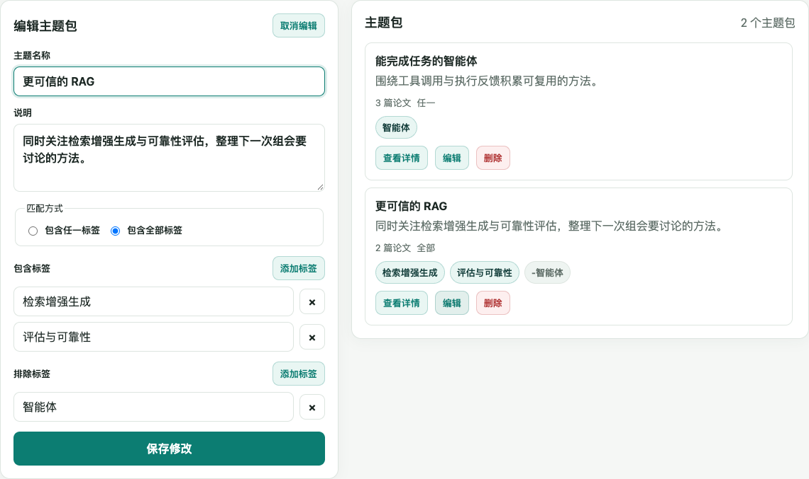

适合准备组会、整理相关工作，或者持续跟进一个小方向。标签合并后，主题包里的包含 / 排除条件也会迁移。

## 本地就能用，AI 按需开启

| 无需模型 API Key | 配置模型后可用 |
| --- | --- |
| 论文收藏、网页剪藏、标签整理 | 根据论文内容生成标签说明 |
| 本地全文搜索、标签、阅读状态和评分筛选 | 用自然语言做语义检索 |
| 研究主题包、共享标签相似推荐 | 结合论文内容推荐库内相关论文 |
| JSON 导入 / 导出、备份 | 提出同义标签合并建议 |

支持本机已登录的 **Claude Code、Codex**，以及 **Qwen / DashScope、智谱 GLM、Kimi Code、DeepSeek** 和**通用 OpenAI 兼容 API**。所选后端统一用于概念匹配、标签说明、翻译和推荐。

论文库保存在本机，不需要注册账号。**连接本机 CLI 或配置 API 后，自动说明、摘要翻译和新论文相似推荐可能在后台向所选模型服务发送必要文本。本机 CLI 并不意味着模型离线运行。** 自动标签说明可在设置中关闭；生成说明会使用最多 6 篇关联论文的内容片段，并不表示模型读过完整 PDF。API Key 和桥接连接码不进入 JSON 导出和备份。

还支持中英文界面、跟随系统的深色模式、引用量查询，以及每天下午 4 点触发的自动 JSON 备份。浏览器需运行；大库请同时使用手动导出。详见 [功能说明](docs/features.zh-CN.md) 与 [隐私政策](PRIVACY.md)。

## 阅读进度单独管理

**未读 → 在读 → 已读 → 待重读**是独立字段，可在收藏时设置，在详情页直接更新，并在论文库筛选。它不会占用概念标签配额。记忆句参与全文检索，也会成为 AI 理解标签的上下文。

旧版数据保留原标签，默认补上“未读”和空记忆句；不会根据历史标签猜测阅读状态。合并不同来源时保留目标论文进度，额外的记忆句进入笔记。JSON 备份会保留这些字段。

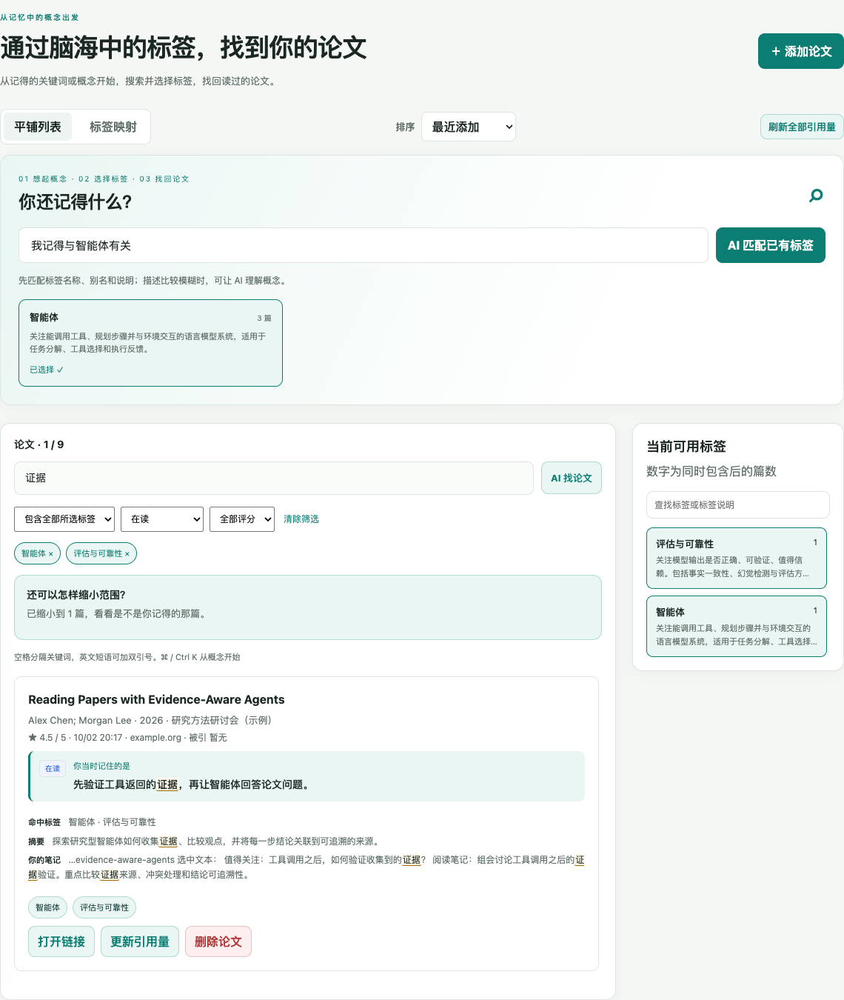

## 接入本机 Claude Code / Codex，或其他模型 API

本机接入参考了 LLM_in_Word 的方式：**浏览器扩展 → 本机桥接 → 已登录的 CLI**。基础收藏与本地检索照常独立运行；只有使用本机模型时才需要这个可选服务。

1. 安装 Node.js（建议 22 或更新版本）及需要使用的 CLI，在终端完成 `claude auth login` 或 `codex login`。
2. 进入下载或克隆的 **Paper_Mind 项目根目录**，运行：

   ```bash
   npm run bridge
   ```

   桥接本身只用 Node 内置模块，不需要先安装项目开发依赖。
3. 打开 **管理页 → 模型设置 → Claude Code / Codex**，填写终端打印的地址和连接码，点击 **检测本机连接**。
4. 检测连接会读取模型目录，也可点 **刷新模型列表**。分别选择 Claude / Codex 的 **模型** 和 **effort（思考强度）**，也支持自定义模型 ID；默认项交给 CLI 决定。**保存设置**后，点击 **测试模型**验证。保持终端运行，用 `Ctrl+C` 停止服务。

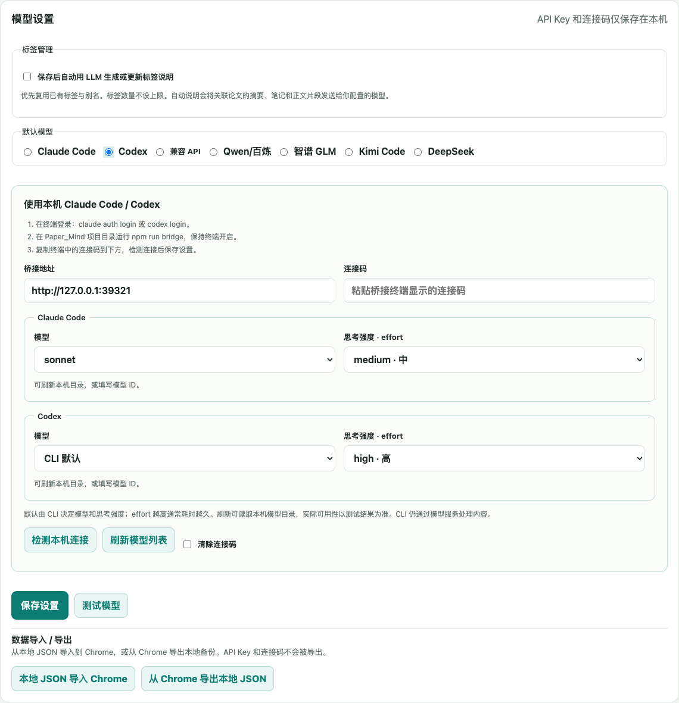

桥接只监听 `127.0.0.1`，验证连接码并限制并发。默认连接码保存在 `~/.paper-mind/bridge-token`，重启可复用。API 模型直接在 **兼容 API** 中填写 Base URL、模型名和 Key；本地兼容服务可以不填 Key。JSON mode 默认关闭，服务商明确支持时再开启。

只支持 Chat Completions 兼容接口；原生 Anthropic Messages / Responses API 不会自动转换。连接 CLI 成功仅表示已安装并登录，实际请求仍受模型权限、网络和账号额度限制。详细配置、路径覆盖与故障排查见 [本机模型接入说明](docs/local-models.md)。

## 几步开始使用

**加载扩展不需要编译，也不需要启动服务。**

1. 在仓库页面点击 **Code → Download ZIP** 并解压，或克隆这个仓库。
2. 打开 `chrome://extensions`，开启右上角 **开发者模式**。
3. 点击 **加载已解压的扩展程序**，选择项目中的 **`extension/` 文件夹**，不是整个项目文件夹。
4. 把 Paper_Mind 固定到工具栏。打开一篇论文，点击图标即可收藏。

**已安装旧版？** 更新本地文件后，点击扩展卡片上的 **↻ 刷新**，重新打开管理页即可，无需卸载。

**需要 AI 标签说明？** 在 **管理页 → 模型设置** 选择本机 CLI 或 API 后端，保存设置后到标签库补全说明。

**需要查看本地剪藏图片？** 在扩展详情中开启 **允许访问文件网址**。

## 开发与贡献

扩展使用原生 ES 模块。日常修改流程：编辑 `extension/` → 刷新扩展 → 验证功能。

```bash
npm ci
npm test                         # 搜索、存储、后台任务等逻辑测试
npx playwright install chromium
npm run test:ui                  # 浏览器交互回归
npm run package:extension        # 产出 dist/Paper_Mind-extension.zip
```

已有 Chrome 时可使用 `PW_CHANNEL=chrome npm run test:ui`。测试使用隔离数据与模拟模型回复。

- [参与贡献](CONTRIBUTING.md) · [版本记录](CHANGELOG.md) · [截图生成说明](assets/screenshots/README.md)
- 计划探索：Chrome 应用商店、BibTeX / Zotero 导出、其他浏览器与自定义剪藏目录。以上尚未作为现有功能提供。
- [Apache License 2.0](LICENSE)
