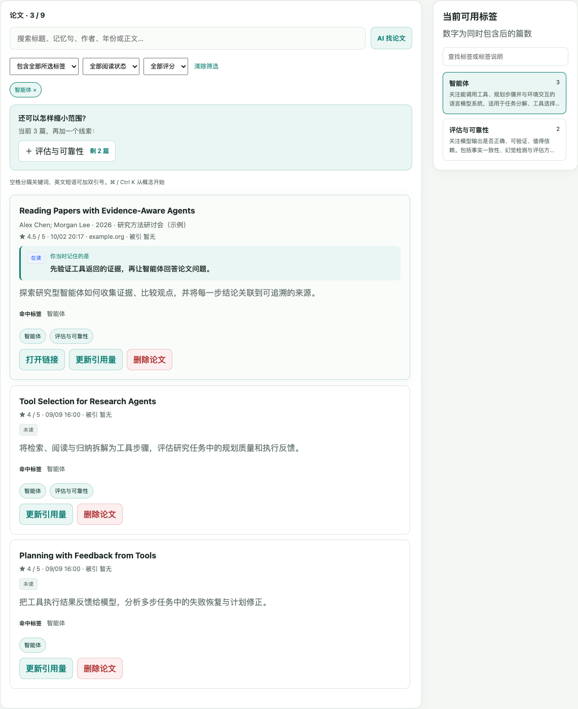

<div align="center">


<h1>Paper_Mind</h1>

<h3>通过脑海中的标签，找回读过的论文。</h3>

<p>基于标签与个人记忆的轻量论文管理插件，支持本地收藏、渐进检索和可选的大模型辅助。</p>

[](CHANGELOG.md)
[](extension/manifest.json)
[](LICENSE)

[English](README.md) · **简体中文**

[功能概览](#核心功能) · [快速安装](#快速开始) · [使用流程](#使用流程) · [模型配置](#模型配置) · [文档](#文档导航) · [参与贡献](#开发与贡献)

</div>

读过一篇论文后，标题和方法细节可能渐渐模糊，脑海里只留下几个印象：**“好像是智能体的优化”“似乎关于 OPD 算法”“可能是 XXX 某个团队出品”**。

Paper_Mind 用多个标签保留一篇论文的不同侧面，再用“一句话记住它”留下你的理解。下次查找时，从还记得的线索出发：**脑海中的概念 → 已有标签 → 逐步缩小范围 → 找回论文**。

## 视频演示

中文版 · **2 分 37 秒** · 中英双语字幕。在当前页面播放，了解从收藏到找回的完整流程。

https://github.com/user-attachments/assets/3b7d2957-d1b1-41b9-b210-005e53877e07

[下载视频](assets/videos/paper-mind-intro-zh.mp4) · [字幕](assets/videos/paper-mind-intro-zh.srt) · [文字稿](assets/videos/transcript.zh-CN.md)

## 核心功能

| 功能 | 你可以做什么 |
| --- | --- |
| **论文收藏与网页剪藏** | 保存论文、博客和解读文章；保留标题、摘要、来源、作者、年份与发表出处，把同一篇论文的多份材料归在一起。 |
| **从概念找回论文** | 搜索已有标签的名称、别名和说明；描述模糊时，可让 AI 推荐相关的已有标签。 |
| **逐步缩小范围** | 选中标签后，查看“还可以怎样缩小范围”及剩余篇数；组合标签，并叠加阅读状态与评分筛选。 |
| **保留当时的理解** | 收藏时写下“一句话记住它”；结果中直接展示记忆句和命中片段，帮助认出目标论文。 |
| **有说明的标签体系** | 一篇论文可选多个标签，数量不限；支持别名、复用、合并审核，以及根据标签和论文内容生成的 AI 说明。 |
| **阅读与关联发现** | 独立管理未读、在读、已读、待重读；查看共享标签的相关论文，按需使用 AI 摘要翻译和内容推荐。 |
| **研究主题包** | 用包含、排除标签保存一个研究方向，符合规则的新论文自动进入相应清单。 |
| **本地数据管理** | 中英文界面、深色模式、JSON 导入导出与定时备份；基础收藏和查找无需注册账号。 |

**基础功能无需配置模型。** AI 用于概念匹配、标签说明、语义检索、翻译、内容推荐和同义标签合并建议，可按需要接入。

## 快速开始

### 1. 获取项目

[下载项目 ZIP](https://github.com/ZJU-OmniAI/Paper_Mind/archive/refs/heads/main.zip) 并解压，或使用 Git：

```bash
git clone https://github.com/ZJU-OmniAI/Paper_Mind.git
```

### 2. 加载到 Chrome

1. 打开 `chrome://extensions`，开启右上角 **开发者模式**。
2. 点击 **加载已解压的扩展程序**，选择项目里的 **`extension/` 文件夹**，其中应包含 `manifest.json`。
3. 把 Paper_Mind 固定到浏览器工具栏。

**扩展可直接加载，无需编译、安装 npm 依赖或启动服务。** 本机 Claude Code / Codex 接入所需的桥接是可选功能，见 [模型配置](#模型配置)。

### 3. 收藏第一篇论文

打开论文页面 → 点击 Paper_Mind 图标 → 检查信息 → 选择标签 → 写下一句话 → **保存到论文库**。点击弹窗中的 **管理**，即可浏览和查找收藏。

已安装的用户：更新本地项目文件后，在 `chrome://extensions` 点击 Paper_Mind 的 **刷新**，再重新打开管理页。使用本机模型时，同时重启桥接。

## 使用流程

### 收藏时，留下将来能想起的线索

1. **检查论文信息**：确认标题、摘要、作者、年份和出处；缺失内容可以手动补充，已有记录也可按需查询补全。
2. **用多个标签描述它**：研究方向、方法、团队可以分别成为标签；优先复用已有名称，并阅读标签说明。
3. **写一句话记住它**：记录你为什么关注这篇论文，例如“先验证工具返回的证据，再让智能体回答论文问题”。阅读进度另设为“在读”。

**一篇论文对应多个标签，一个标签也关联多篇论文。** 标签共同描述内容，阅读状态单独管理；暂时不选标签也能收藏，论文会进入“待归类”。

### 查找时，从模糊到具体

| 步骤 | 操作 | 结果 |
| --- | --- | --- |
| 想起一个概念 | 在“你还记得什么？”输入“智能体优化” | 找到相关的已有标签，并查看含义与论文数量。 |
| 选中一个标签 | 查看该标签关联的论文 | 得到一组候选，列表提示下一步可用哪些标签缩小范围。 |
| 补上一条线索 | 加入“评估与可靠性”，选择“包含全部” | 只保留同时符合两个标签的论文。 |
| 认出当时的理解 | 查看结果中的记忆句、命中片段与阅读笔记 | 找回论文，以及当时收藏它的原因。 |



`⌘ / Ctrl K` 聚焦搜索；全文搜索支持空格分隔的关键词和带引号的短语。搜索不会自动创建标签。

**[查看完整图文教程 →](docs/walkthrough.zh-CN.md)** 从打开收藏弹窗到找回同一篇论文，按 8 张步骤截图操作。更详细的剪藏、标签、元数据和主题包说明见 [功能手册](docs/features.zh-CN.md)。

> 视频和截图使用实际界面与隔离的示例库。论文、作者、笔记和 AI 内容为演示素材。

## 模型配置

先在 **管理页 → 模型设置** 选择接入方式：

| 接入方式 | 需要准备 | 是否需要桥接 |
| --- | --- | --- |
| **Claude Code / Codex** | Node.js（建议 22 或更新版本），以及已安装、已登录的对应 CLI | 是，使用时保持 `npm run bridge` 运行 |
| **模型服务 API** | Qwen、智谱 GLM、Kimi Code、DeepSeek，或其他 Chat Completions 兼容服务的配置 | 否 |
| **本地模型 API** | 已运行且提供 Chat Completions 兼容接口的本机模型服务 | 否 |

### 本机 Claude Code / Codex

1. 在终端登录要使用的 CLI：`claude auth login` 或 `codex login`。
2. 在 **Paper_Mind 项目根目录**运行：

   ```bash
   npm run bridge
   ```

3. 将终端显示的地址和连接码填入模型设置，点击 **检测本机连接**。
4. 选择 **模型** 与 **effort（思考强度）**，保存设置，再点击 **测试模型**。

登录和连接配置通常只需首次完成；每次使用本机模型时需要桥接处于运行状态。连接码默认可复用，保持终端开启即可，`Ctrl+C` 停止。基础收藏和本地搜索不依赖桥接。

### API 或本地模型服务

在对应服务或 **兼容 API** 中填写 Base URL、模型 ID 和所需的 API Key，保存并测试。无认证的本地服务可以不填 Key。自定义接口须兼容 **Chat Completions**；JSON mode 默认关闭。

**[详细配置与故障排查 →](docs/local-models.md)** 包括模型目录、effort、连接码、路径覆盖和常见错误。

## 数据与隐私

- **论文库在本机**：论文、标签、记忆句和阅读进度保存在扩展的 IndexedDB；模型设置保存在浏览器本地存储中。
- **备份可导出**：在模型设置底部导入、导出 JSON；每日 16:00 的自动备份需要浏览器运行。API Key 和桥接连接码不进入备份。
- **剪藏图片单独保存**：图片保存在 Chrome 下载目录，JSON 包含路径而非图片本身。迁移时一并保留图片目录；显示本地图片需在扩展详情开启“允许访问文件网址”。
- **AI 按所选服务处理文本**：配置模型后，标签说明、摘要翻译和相关推荐可能在后台发送必要内容。本机 CLI 接入也可能调用远程模型。自动标签说明可在设置中关闭。

详见 [隐私政策](PRIVACY.md)。

## 常见问题

<details>
<summary><strong>没有模型账号或 API Key，能用吗？</strong></summary>

可以。收藏、剪藏、标签管理、本地搜索、组合筛选、阅读状态、主题包和 JSON 备份均可直接使用。配置模型后才启用相应的 AI 能力。

</details>

<details>
<summary><strong>标签会不会越来越多？</strong></summary>

标签数量不设上限。输入时优先搜索名称、别名与说明，复用已有标签；同义概念可通过合并审核整理。AI 搜索只匹配已有标签，不会为每次查询生成新标签。

</details>

<details>
<summary><strong>为什么作者、年份或出处没有自动填好？</strong></summary>

部分页面不提供完整的学术元数据。可手动填写，或在论文详情的编辑页点击“补全空缺信息”，通过 Semantic Scholar / Crossref 查询。补查只填空缺，核对后保存；查不到的事实不会由模型编造。

</details>

<details>
<summary><strong>为什么引用量与 Google Scholar 不一样？</strong></summary>

引用量来自 **Semantic Scholar**，不是所有数据库的总和；不同平台的收录范围不同，[官方说明](https://webflow.semanticscholar.org/faq/estimated-citations)也明确指出计数可能不同。点击论文卡片中的来源可打开匹配记录，详情页显示匹配标题和数据获取时间。

匹配优先使用论文来源中的 arXiv ID / DOI，并核对标题；标题检索只接受规范化后完全相同且可唯一确认的记录，可结合已填写的作者和年份消歧。不会因候选的引用量更大就采用它，也不会把笔记里的任意参考文献链接当成论文来源。真实的 0、未收录、匹配待确认和刷新失败会分别显示。刷新失败时保留已核验的上次记录并标注；升级后旧计数会自动重新核验，也可点击“刷新全部引用量”。

</details>

## 文档导航

| 文档 | 内容 |
| --- | --- |
| [图文教程](docs/walkthrough.zh-CN.md) | 从首次收藏到通过标签找回论文 |
| [功能手册](docs/features.zh-CN.md) | 剪藏、标签、主题包、元数据和数据管理细节 |
| [模型接入](docs/local-models.md) | 本机 CLI、API 配置与故障排查 |
| [版本记录](CHANGELOG.md) | 各版本变更 |
| [贡献指南](CONTRIBUTING.md) | 代码结构、开发约定与验证方法 |
| [视频与素材](assets/videos/README.md) | 文字稿、字幕和演示素材制作说明 |

## 开发与贡献

项目由原生 JavaScript / ES 模块实现的 Chrome MV3 扩展，以及可选的 Node.js 本机桥接组成。应用代码位于 `extension/`，桥接位于 `bridge/`，测试位于 `tests/`。

```bash
npm ci
npm test
npx playwright install chromium
npm run test:ui
npm run package:extension
```

打包产物为 `dist/Paper_Mind-extension.zip`。已有 Chrome 时，可用 `PW_CHANNEL=chrome npm run test:ui` 执行浏览器测试。修改扩展后重新加载即可查看效果。

欢迎通过 [Issues](https://github.com/ZJU-OmniAI/Paper_Mind/issues) 反馈问题，或提交 Pull Request。开始前请阅读 [贡献指南](CONTRIBUTING.md)。

## 开源协议

[Apache License 2.0](LICENSE)。
