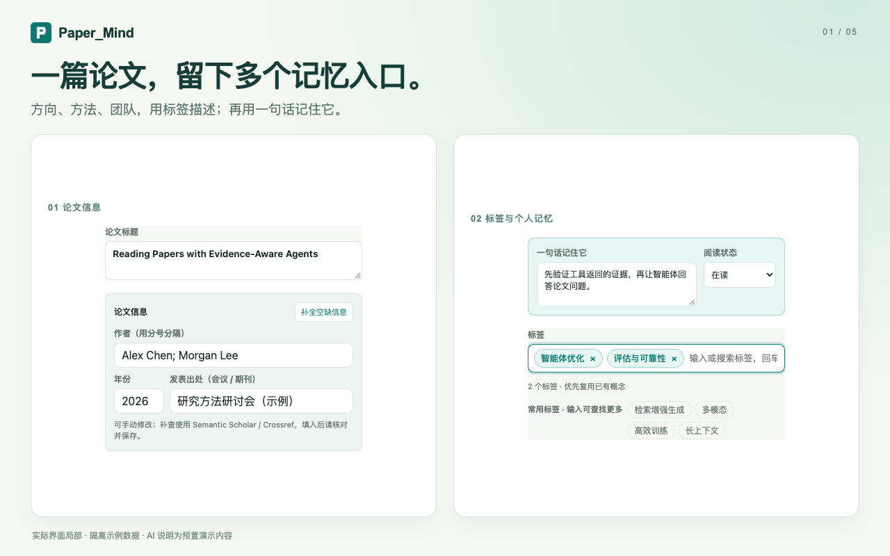
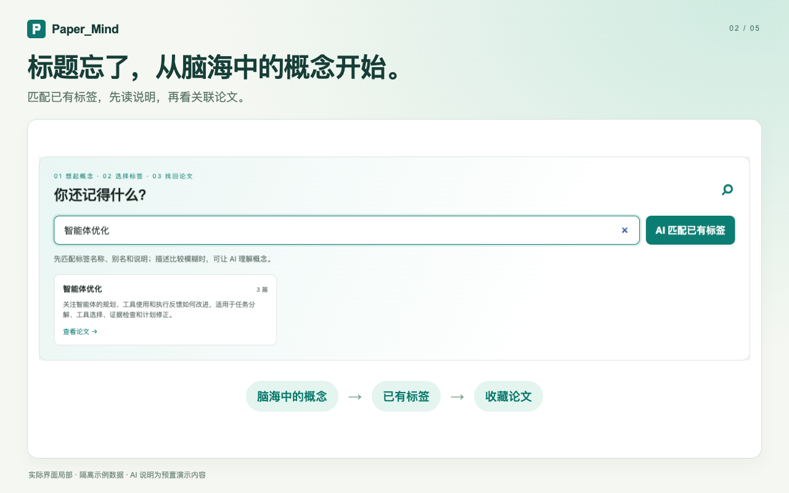
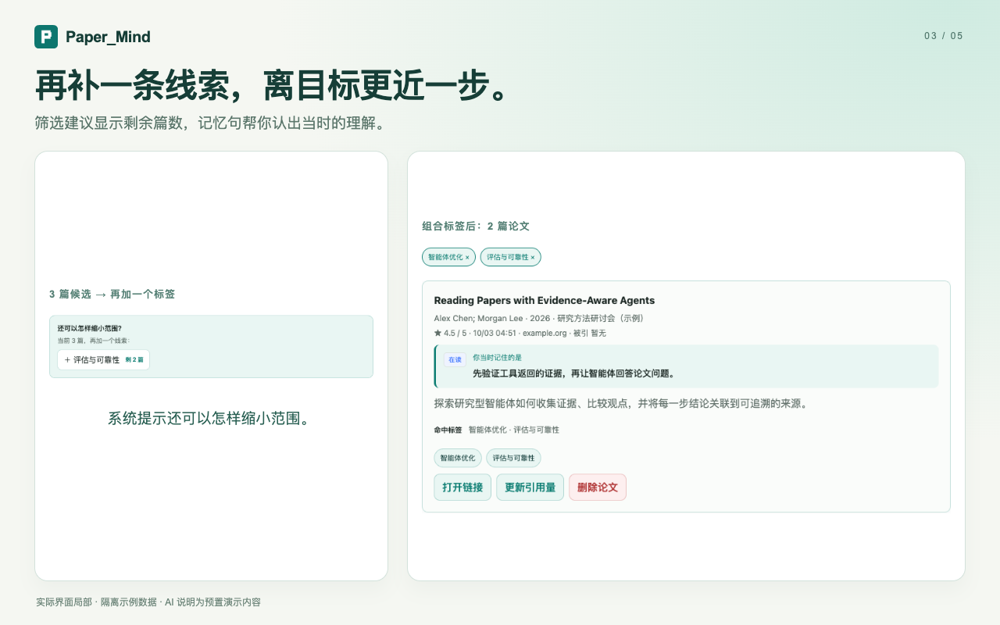
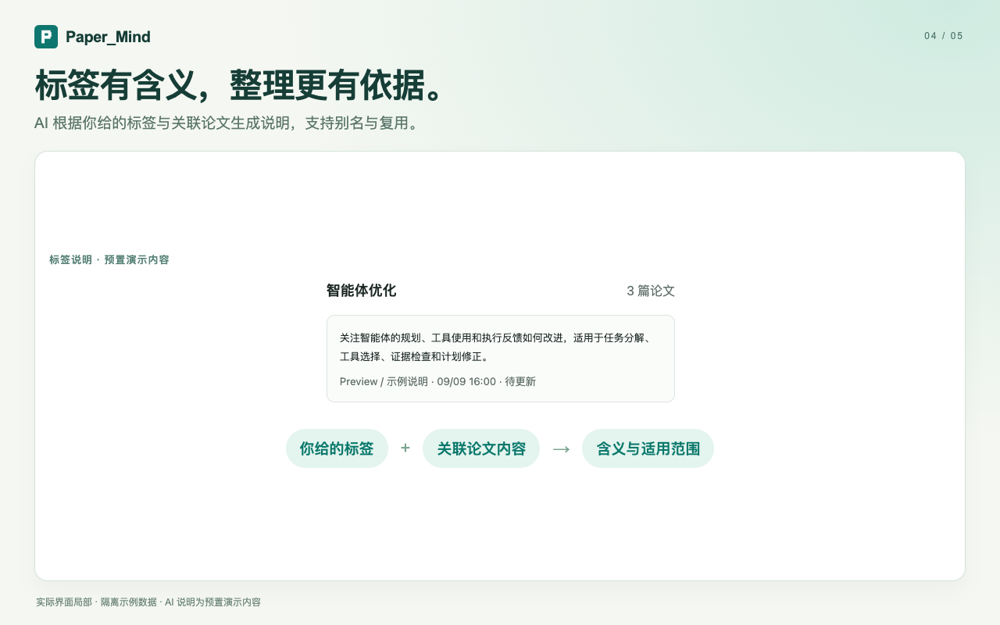
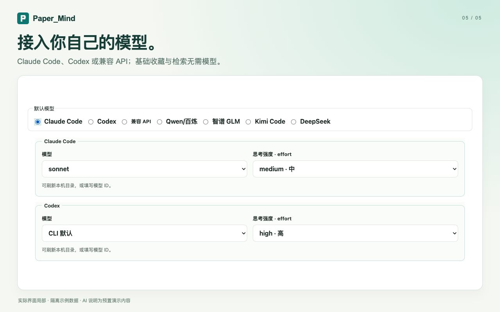
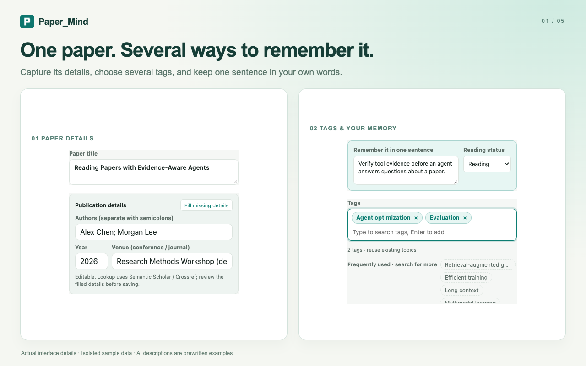
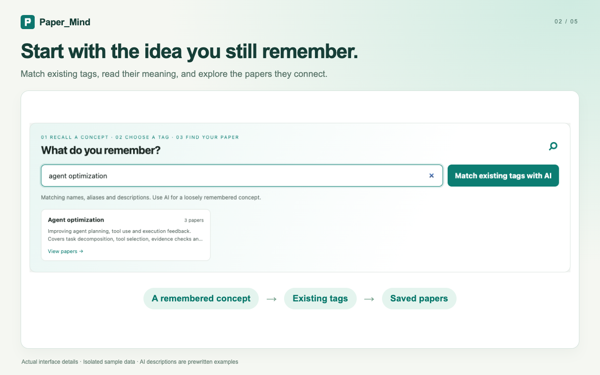
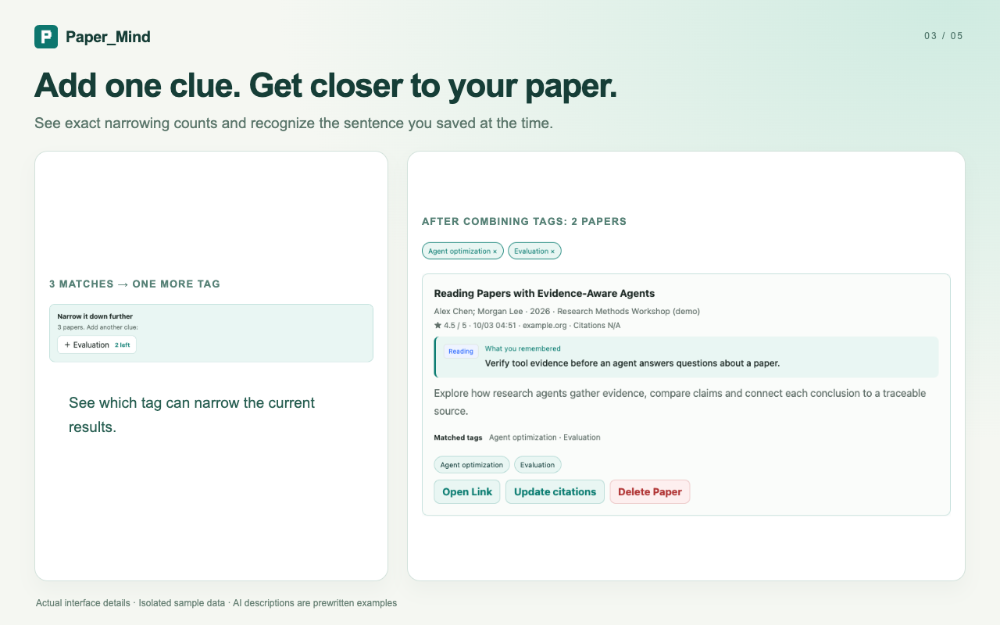
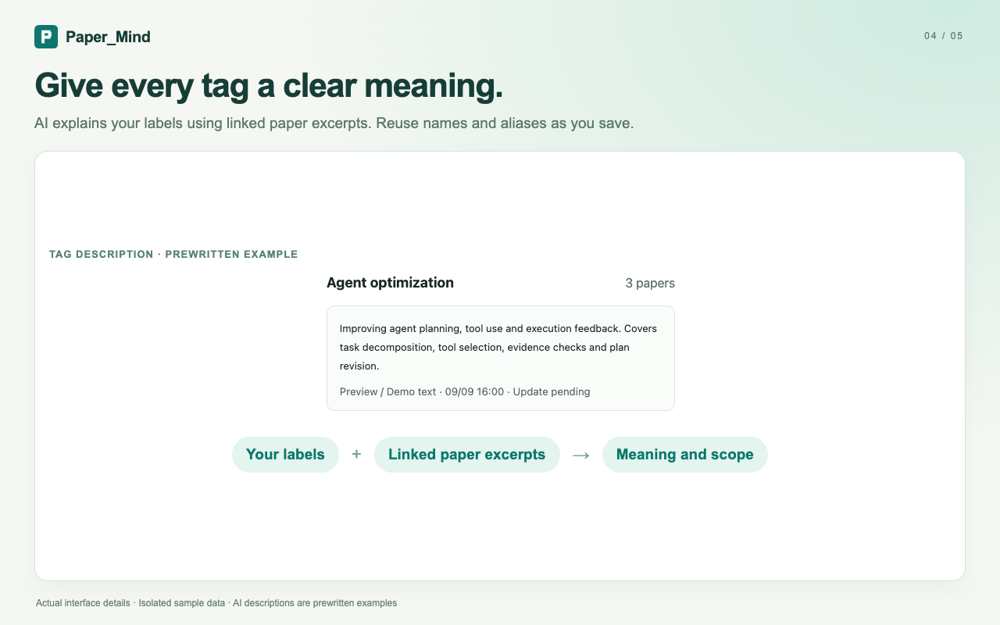
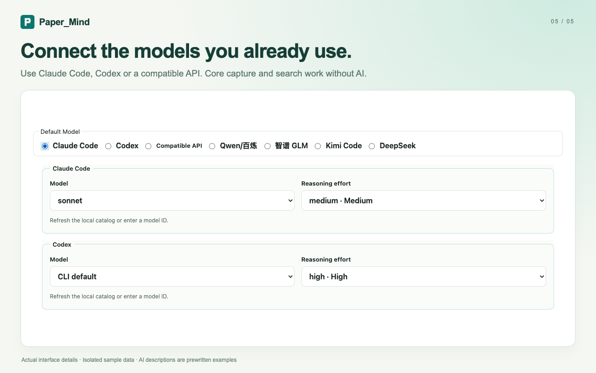

# Chrome Web Store 图片

所有 PNG 可直接上传，无需裁切。每种语言按 01 → 05 顺序上传 5 张截图；不要将两种语言共 10 张上传到一个语言页面。

| 文件 | 尺寸 | 用途 |
| --- | --- | --- |
| `icon-128.png` | 128 × 128 | 图标；96 × 96 主体，四周 16 px 透明留白 |
| `promo-small.png` | 440 × 280 | 必填小宣传图 |
| `promo-marquee.png` | 1400 × 560 | 可选大型宣传图 |
| `01-capture-{zh,en}.png` | 1280 × 800 | 多标签收藏、记忆句、阅读状态与文献信息 |
| `02-recall-{zh,en}.png` | 1280 × 800 | 概念 → 已有标签 → 论文 |
| `03-refine-{zh,en}.png` | 1280 × 800 | 筛选建议、剩余数量、结果中的记忆句 |
| `04-tags-{zh,en}.png` | 1280 × 800 | 标签说明及其来源 |
| `05-models-{zh,en}.png` | 1280 × 800 | CLI / API、模型与 effort 选择 |

宣传图不按语言分别上传，使用统一品牌及简短标签示意；不要把 SVG 源文件当作上传文件。截图使用实际界面局部和隔离的虚构示例库，底部已注明示例数据和预置 AI 说明。没有伪造实时生成结果、下载量、评分或推荐背书。

## 中文预览







## English preview







## 重新生成

在仓库根目录安装开发依赖后运行：

```bash
npm ci
npx playwright install chromium
npm run store:assets
```

已有 Chrome 时可用 `PW_CHANNEL=chrome npm run store:assets`。流程不访问真实论文库、不读取用户模型凭据、不发送外部模型请求。重新生成会同步更新两个审核示例 JSON；图片合成源位于 `scripts/store/` 和 `scripts/render-store-art.mjs`。

官方规格：[图片要求](https://developer.chrome.com/docs/webstore/images)。
