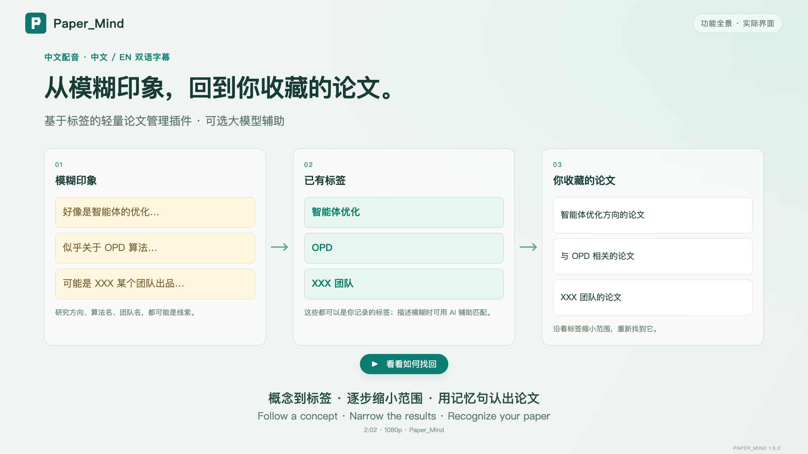
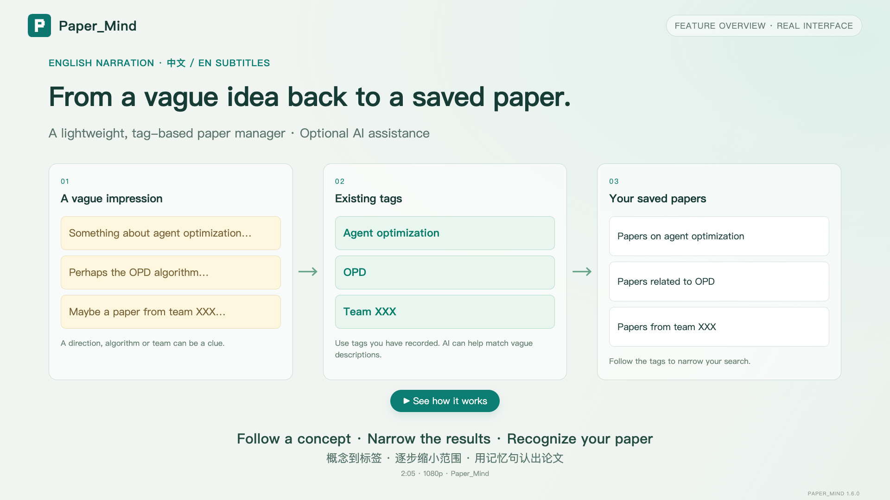

# Paper_Mind · 两分钟找回论文 / Find your paper in a two-minute tour

| 中文配音 · Mandarin narration | English narration · 英文配音 |
| --- | --- |
| [](paper-mind-intro-zh.mp4) | [](paper-mind-intro-en.mp4) |
| [观看 / 下载 MP4](paper-mind-intro-zh.mp4) · [双语 SRT](paper-mind-intro-zh.srt) · [文字稿与章节](transcript.zh-CN.md) | [Watch / download MP4](paper-mind-intro-en.mp4) · [Bilingual SRT](paper-mind-intro-en.srt) · [Transcript and chapters](transcript.en.md) |

中文版 2:02，英文版 2:05，1920 × 1080。**两版均将完整的中英双语字幕直接显示在画面中**，无需另外开启字幕。主字幕对应配音语言，下一行为译文；SRT 也包含两种语言。英文版使用英文产品界面。

Both editions show complete Chinese and English subtitles together, burned into the video. The primary line follows the narration language; its translation appears beneath it. Both SRT files are bilingual. Each edition uses the matching interface language.

## 内容范围 / Coverage

开场保留阅读后的真实困境：标题和实现细节模糊了，只留下“好像是智能体的优化”“似乎关于 OPD 算法”“可能是 XXX 某个团队出品”这些线索。用“今天收藏时，就把线索一起留下”自然承接收藏，再回到日后凭印象找论文。时间标记见上方文字稿。

The opening uses three memory clues: agent optimization, the OPD algorithm, and a paper from team XXX. They represent a research direction, an algorithm name, and a team's identity. After showing how clues connect to existing tags and saved papers, a bridge explains: keep the clues when saving a paper today, so you can find it again later. XXX is a placeholder, not an attribution to a real team.

新版以一次成功找回为主线，缩短设置操作和逐项讲解。1.6.0 的三个新功能融入同一个故事：**收藏时带上作者、年份与出处 → 标签建议把 3 篇缩小到 2 篇 → 用记忆片段找到 1 篇，看到自己当时记下的那句话**。随后快速展示整理、阅读、研究主题和模型接入；不逐个按钮教学。

The 1.6.0 tour centers on one successful rediscovery: **capture publication details → follow tag suggestions from 3 papers to 2 → use a remembered phrase to find 1, with your original one-line memory highlighted**. Organization, reading, topic packs and model choices follow as a short overview, without a detailed settings tutorial.

| 功能 | What the overview covers |
| --- | --- |
| 收藏与论文信息 | Authors, year and venue, missing-detail lookup, one-line memories, notes, web text and images |
| 材料归档 | Papers, commentary, external links, duplicate alerts and confirmed merges |
| 记忆与阅读进度 | Original memory sentences in results, highlighted evidence and separate reading states |
| 概念到论文 | Remembered concepts → existing tags → narrowing suggestions with exact counts → the right paper |
| 有含义的标签 | AI descriptions, scope, aliases, redundancy review and reviewed merges |
| 阅读与发现 | Abstract translation, citations, similar papers and tag maps |
| 研究主题包 | Dynamic collections using inclusion and exclusion tags |
| 模型接入 | Claude Code / Codex bridge, model and effort choices, compatible APIs |
| 轻量与数据管理 | No-account basic workflows, bilingual UI, themes, import/export and automatic backups |

## 配音与素材 / Voice and footage

- 中文：`zh-CN-YunyangNeural`，沉稳男声，语速 `-8%`，音高 `-5Hz`。
- English: `en-US-AndrewNeural`, warm male voice, rate `-8%`, pitch `-4Hz`.
- 两版均做轻微低频修饰、柔和压缩与两遍响度校准，并在重采样后限制峰值，为 AAC 编码保留余量；无背景音乐。
- 使用 [edge-tts](https://github.com/rany2/edge-tts) 调用在线语音服务，发送的内容仅为本仓库公开的介绍文案。语音合成需要联网，不是全离线制作；未发送个人论文库或凭据。两版均为合成配音。

开头的记忆、标签映射和阅读过程画面为示意图；随后使用实际扩展页面和隔离的示例库。收藏、IndexedDB 保存、概念匹配、筛选、阅读状态和导出均执行真实应用代码。输入“智能体优化 / agent optimization”匹配已有标签，9 篇收藏中得到 3 篇；新增“评估”标签后剩 2 篇，再搜索 `验证工具` / `"verify tool"` 得到 1 篇，并高亮记忆句与真实笔记片段。脚本核对每一步计数、作者 / 年份 / 出处、记忆句、评分、阅读状态、主题包的 2 篇论文及导出结果。

论文、作者、年份、出处、标签说明、译文与剪藏材料均为合成演示内容，不代表真实研究结论或现场模型生成。补查信息只展示入口，没有伪造在线查询成功；模型接入部分只展示配置选项。录制不填写真实凭据、不连接用户账号、不调用论文处理模型。浏览器只允许访问本机演示服务器，未使用个人浏览器资料。外层标题、双语字幕、指针和高亮用于讲解；不修改产品界面或伪造成功响应。

The opening memory, tag mapping and reading-journey visuals are explanatory illustrations. Subsequent footage uses the actual extension with synthetic fixtures, including a real search for “agent optimization” that matches an existing tag. AI descriptions and translations are prewritten examples, not live model results. No personal library, account or credentials are used. Only the public narration text is sent to the online speech service. Basic capture/search works without an LLM; enabling AI features may send relevant paper content to the configured backend.

## 本地重新制作 / Reproduce

依赖：Node.js、FFmpeg / ffprobe（支持 H.264 / AAC）、Python 与 `edge-tts`，以及项目的 Playwright 开发依赖。默认录制中英文两版；首次语音合成需要联网，后续按文案和声音参数复用缓存。

```bash
npm ci
python3 -m pip install edge-tts==7.2.8
npx playwright install ffmpeg
# 使用已安装的 Chrome / use an installed Chrome
PW_CHANNEL=chrome npm run demo:video

# 未安装 Chrome：安装 Chromium，并省略 PW_CHANNEL
# npx playwright install chromium
# npm run demo:video
```

可选环境变量：

```bash
# 仅验证界面、功能断言和双语字幕，不生成配音或视频
PW_CHANNEL=chrome DEMO_CHECK=1 npm run demo:video
# 只制作一种配音版本 / render one edition
PW_CHANNEL=chrome DEMO_LANG=en npm run demo:video
# 已录好画面，仅重新编码音视频 / reuse existing raw footage and timeline
PW_CHANNEL=chrome DEMO_ENCODE_ONLY=1 npm run demo:video
```

`DEMO_VOICE_ZH` / `DEMO_VOICE_EN` 可覆盖默认声线；`EDGE_TTS_BIN` 可指定语音命令路径。语速、音高和双语文案在分镜文件中维护。更改文案会生成新的音频缓存。

- 旁白与分镜：[story.mjs](../../scripts/demo/story.mjs)
- 神经网络配音、重试与缓存：[speech.mjs](../../scripts/demo/speech.mjs)
- 双语字幕与画面包装：[stage.html](../../scripts/demo/stage.html)
- 截图与视频共用的隔离数据：[fixture.mjs](../../scripts/demo/fixture.mjs)
- 录制、断言与编码：[make-demo.mjs](../../scripts/make-demo.mjs)
- 成片参数与章节起点：[中文 metadata](production-zh.json) · [English metadata](production-en.json)

成片、封面、SRT 与文字稿输出到本目录；README 使用的中英流程图由同一录制脚本生成到 `assets/screenshots/concept-recall-{zh,en}.png`。音轨、逐场景检查截图、原始录屏和完整时间轴位于被 Git 忽略的 `dist/demo-v2/`。MP4 使用 H.264 / AAC、1080p 和 faststart；可在 GitHub 文件页预览或下载。
